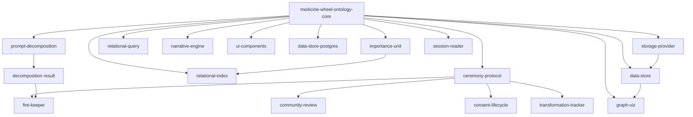
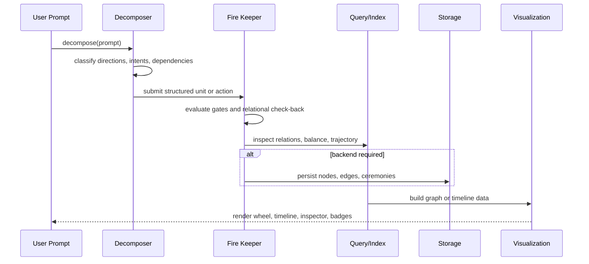

Medicine Wheel is a layered monorepo. The important architectural fact is that nearly every package depends on `medicine-wheel-ontology-core`, and most higher-level packages remain pure in-memory logic until you intentionally connect storage or UI.

## Key Design Decisions

### `ontology-core` is the single source of truth

`src/ontology-core/src/index.ts` re-exports types, schemas, constants, vocabulary, and query helpers from one entry point. That keeps downstream packages from redefining fundamental concepts like `DirectionName`, `Relation`, `OcapFlags`, or `NarrativeBeat`. The result is that decomposition, traversal, storage, and visualization all agree on the same shape without adapter layers. The package is intentionally broad because the rest of the workspace is intentionally narrow.

### Packages stay composable and mostly side-effect free

Most packages export pure functions or small classes. `src/importance-unit/src/unit.ts`, `src/relational-query/src/query.ts`, `src/relational-index/src/index-manager.ts`, and `src/narrative-engine/src/arc.ts` all follow the same pattern: accept structured input, return new objects or analysis results, and avoid hidden runtime state. That makes them easy to combine in scripts, servers, and tests. The main exceptions are storage packages and React component packages, which necessarily touch I/O or rendering.

### Governance is modeled as workflow logic, not comments

`src/ceremony-protocol/src/index.ts` encodes path matching, ceremony requirements, access levels, and blocking gate results. `src/fire-keeper/src/gating.ts` and `src/fire-keeper/src/check-back.ts` then turn relational expectations into explicit runtime decisions. The design choice here is important: governance is enforced through data and functions, not just conventions or README text. Packages like `community-review`, `consent-lifecycle`, and `transformation-tracker` continue the same pattern for review, consent, and validity.

### Storage is intentionally abstracted late

There are three storage layers because the project separates "domain API" from "backend choice". `src/data-store/src/store.ts` provides Redis-oriented CRUD helpers. `src/data-store-postgres/src/connection.ts` is a small pool-management seam for PostgreSQL/Neon. `src/storage-provider/src/interface.ts` defines a backend-agnostic `StorageProvider`, with `JsonlProvider` and `NeonProvider` implementations in `src/storage-provider/src/jsonl.ts` and `src/storage-provider/src/neon.ts`. This keeps the rest of the workspace from caring whether persistence is local JSONL, Redis, or Postgres.

## Data Lifecycle

A typical request moves through the system in a predictable order:

### 1. Modeling

Everything starts with the ontology package. `src/ontology-core/src/types.ts` defines the entities and relationship types. `src/ontology-core/src/schemas.ts` gives you executable validators for those same shapes.

### 2. Interpretation

`src/prompt-decomposition/src/decomposer.ts` converts free text into directional insights, secondary intents, dependencies, action items, and narrative beats. If you need relational context, `src/prompt-decomposition/src/relational_enricher.ts` maps those intents back onto graph nodes and relations.

### 3. Governance and orchestration

`src/fire-keeper/src/keeper.ts` evaluates an incoming unit by building a `FireKeeperContext`, calling `evaluateGates`, running `relationalCheckBack`, and then deciding whether to accept, hold, deepen, or escalate. That class depends on `ceremony-protocol` concepts but adds active runtime state and message-oriented outcomes.

### 4. Retrieval and analysis

`src/relational-query/src/traversal.ts` walks graph structures with ceremony and OCAP filters. `src/relational-index/src/cross-dimensional.ts` and `src/narrative-engine/src/arc.ts` compute higher-order analysis: convergence, tension, completeness, cadence, and progress.

### 5. Persistence and rendering

The storage packages keep the core logic portable. Once data exists, `src/graph-viz/src/converters.ts` and `src/graph-viz/src/layout.ts` turn it into wheel-friendly nodes and links, while `src/ui-components/src/*.tsx` render focused widgets on top of the same types.

## How The Pieces Fit Together

- `ontology-core` supplies the language.
- `prompt-decomposition`, `importance-unit`, `relational-index`, and `narrative-engine` shape knowledge and planned work.
- `ceremony-protocol` and `fire-keeper` decide whether work can proceed.
- `community-review`, `consent-lifecycle`, and `transformation-tracker` cover higher-governance paths once a workflow becomes accountable to people and communities.
- `relational-query`, `data-store`, and `storage-provider` give the workflow retrieval and persistence.
- `graph-viz` and `ui-components` expose the results.

That split is why the workspace feels large at first but remains tractable in practice: each package owns one slice of the same shared ontology instead of defining a separate universe.
