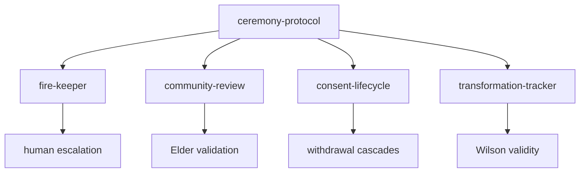

Ceremonial governance is the part of Medicine Wheel that turns values into workflow controls. It exists because the workspace treats review, consent, authority, and transformation as program behavior, not just policy documents.



## What It Is

This concept spans four packages:

- `medicine-wheel-ceremony-protocol`
- `medicine-wheel-community-review`
- `medicine-wheel-consent-lifecycle`
- `medicine-wheel-transformation-tracker`

Together they answer four questions:

1. What ceremony phase are we in?
2. What paths or actions require review before work proceeds?
3. Is consent still active, in scope, and renewable?
4. Did the work actually transform the researcher and benefit relations?

## How It Works Internally

`src/ceremony-protocol/src/index.ts` is the lowest layer. It provides:

- `loadCeremonyState`
- `nextPhase` and `nextPhaseExtended`
- governance matchers such as `checkGovernance`, `checkCeremonyRequired`, and `getAccessLevel`
- a blocking `enforceCeremonyGate`

The implementation is intentionally straightforward: path rules can be exact prefixes or `*` wildcards, and extended phases add `gathering`, `kindling`, `tending`, `harvesting`, and `resting` on top of the simpler four-phase model.

`src/community-review/src/circle.ts`, `src/community-review/src/consensus.ts`, and `src/community-review/src/elder.ts` model review as a stateful review circle rather than a single approval flag. `seekConsensus` requires every reviewer to speak before consensus can be considered, and Elder validation becomes an explicit transition instead of an afterthought.

`src/consent-lifecycle/src/lifecycle.ts` and related modules do the same thing for consent. `grantConsent`, `renewConsent`, `renegotiateConsent`, and `withdrawConsent` always return updated records with history. The package also has scope matching, community consent helpers, and withdrawal cascades in `src/consent-lifecycle/src/cascade.ts`.

`src/transformation-tracker/src/validity.ts` then asks the most demanding question in the suite: was the work valid under Wilson's standard because it changed the researcher, the community, and the relationships? Supporting modules break that into reflections, community impact, relational shifts, reciprocity, seven generations, and prompts.

## Basic Usage

```ts
import {
  loadCeremonyState,
  enforceCeremonyGate,
  type CeremonyState,
} from 'medicine-wheel-ceremony-protocol';

const state = loadCeremonyState({
  ceremony: {
    current_cycle: 'cycle-12',
    host_sun: 'NovelEmergence',
    phase: 'opening',
  },
});

const result = enforceCeremonyGate('/sacred/notes.md', {
  protected_paths: [
    { path: '/sacred/*', access: 'sacred', authority: ['elders'] },
  ],
});

console.log(state?.phase);
console.log(result.blocked);
```

## Advanced Usage

```ts
import {
  createReviewCircle,
  addReviewer,
  submitForReview,
  talkingCircle,
  requestElderValidation,
  seekConsensus,
} from 'medicine-wheel-community-review';

let circle = createReviewCircle('artifact-1', 'research');
circle = addReviewer(circle, {
  id: 'elder-1',
  role: 'elder',
  direction: 'north',
  accountableTo: ['community'],
});
circle = submitForReview(circle);
circle = talkingCircle(circle, {
  speakerId: 'elder-1',
  role: 'elder',
  direction: 'north',
  voice: 'The work needs stronger reciprocity language.',
  timestamp: new Date().toISOString(),
});
circle = requestElderValidation(circle, 'elder-1');

console.log(seekConsensus(circle));
```

<Callout type="warn">Do not treat these packages as interchangeable validation layers. `ceremony-protocol` handles state and path governance, `community-review` models collective review, `consent-lifecycle` handles scope and withdrawal, and `transformation-tracker` measures validity after or during the work. If you collapse them into a single approval flag, you lose the distinctions the code is explicitly modeling.</Callout>

<Accordions>
<Accordion title="Why governance is encoded as functions instead of policy files only">
Encoding governance in functions such as `enforceCeremonyGate`, `seekConsensus`, and `withdrawConsent` gives the surrounding application something executable to depend on. That makes review and consent testable and composable with orchestration code. The trade-off is that policy changes now require code changes or configuration updates, so you need deliberate versioning and review. The alternative, keeping everything in prose, is easier to write but much harder to enforce consistently.
</Accordion>
<Accordion title="Why review and consent are modeled as lifecycle records">
The packages preserve history because governance-sensitive workflows need to answer "what changed, when, and why". A plain boolean cannot represent renewal windows, renegotiation, Elder escalation, or reciprocity prompts. The trade-off is more data and more required fields, especially when your application only wants a quick pass/fail answer. In return, you get auditability and the ability to build humane workflows that do not erase prior state transitions.
</Accordion>
</Accordions>
