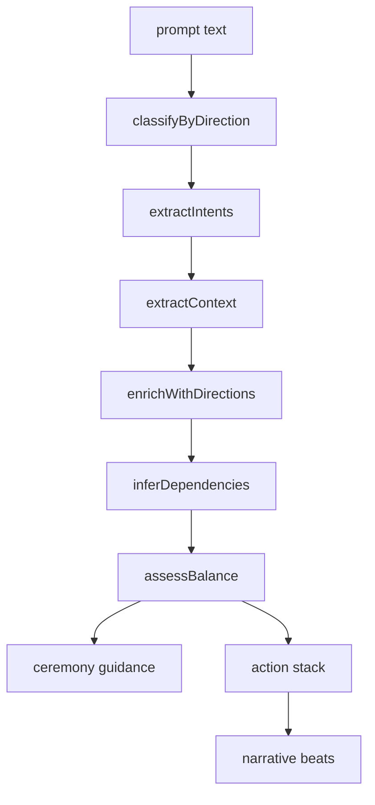

Prompt decomposition is where the workspace turns unstructured requests into directional work. It exists because the project wants interpretation to happen before execution, and it wants that interpretation to be inspectable.



## What It Is

`medicine-wheel-prompt-decomposition` is built around the `MedicineWheelDecomposer` class in `src/prompt-decomposition/src/decomposer.ts`. The package also includes:

- enriched result types in `src/prompt-decomposition/src/types.ts`
- graph-aware enrichment in `src/prompt-decomposition/src/relational_enricher.ts`
- file persistence in `src/prompt-decomposition/src/storage.ts`
- a browser entry point in `src/prompt-decomposition/src/index.browser.ts` that omits Node-only storage helpers

## How It Relates To Other Concepts

This package sits near the front of the workflow:

- it consumes prompt text
- emits structured intents and narrative beats
- can be enriched against ontology relations
- feeds Fire Keeper evaluation or downstream planning

## How It Works Internally

The `decompose` method performs a fixed pipeline:

- `classifyByDirection` scores sentence segments against keyword buckets for East, South, West, and North
- `extractIntents` picks action verbs and targets, and can add implicit intents from hedging language
- `extractContext` captures file references and assumptions
- `enrichWithDirections` assigns each intent a direction and default obligations
- `inferDependencies` links research to action and action to validation when topics overlap
- `assessBalance` measures directional spread
- `checkCeremonyRequired` compares East and West presence against `ceremonyThreshold`
- `buildActionStack` sorts work in directional flow
- `generateNarrativeBeats` turns actions into beats

The package is heuristic by design. It is not using an LLM internally. That means the output is deterministic and cheap, but also obviously dependent on keywords and overlap rules.

## Basic Usage

```ts
import { MedicineWheelDecomposer } from 'medicine-wheel-prompt-decomposition';

const decomposer = new MedicineWheelDecomposer({
  extractImplicit: true,
  mapDependencies: true,
  ceremonyThreshold: 0.3,
});

const result = decomposer.decompose(
  'Research the storage layer, implement the provider, and validate the migration path.'
);

console.log(result.primary);
console.log(result.neglectedDirections);
console.log(result.actionStack);
```

## Advanced Usage

```ts
import {
  RelationalEnricher,
  detectEpistemicSource,
  saveDecomposition,
} from 'medicine-wheel-prompt-decomposition';

const enricher = new RelationalEnricher();
const enriched = enricher.enrich(result, { nodes, edges, relations });

console.log(detectEpistemicSource('walk the territory before implementing the API'));
console.log(enriched.relationalHealth);

saveDecomposition(process.cwd(), enriched.decomposition);
```

<Callout type="warn">The decomposer is heuristic, not authoritative. If a prompt is vague, overloaded, or written in highly project-specific language, direction assignment and dependency mapping can be wrong in systematic ways. Always inspect `ambiguities`, `neglectedDirections`, and `ceremonyRequired` before treating the result as execution-ready.</Callout>

<Accordions>
<Accordion title="Why the decomposer is heuristic instead of model-backed">
The code in `src/prompt-decomposition/src/decomposer.ts` uses keyword scoring, verb buckets, and overlap checks rather than a probabilistic model. That makes the package portable, deterministic, and easy to run in local tooling or CI. The trade-off is lower semantic sophistication, especially for domain-specific or subtle prompts. For this workspace that trade is defensible because the output is supposed to be reviewed, enriched, and possibly gated later rather than executed blindly.
</Accordion>
<Accordion title="Why directional balance drives ceremony guidance">
The package does not just detect actions; it also checks whether East, South, West, and North are all meaningfully present. That is why `assessBalance`, `checkCeremonyRequired`, and `generateCeremonyGuidance` are core parts of the flow rather than optional add-ons. The trade-off is that some prompts will be marked as ceremonially weak even when a user only wanted a narrow operational answer. In return, the package preserves the suite's design goal: under-specified work should become visible before it becomes executable.
</Accordion>
</Accordions>
