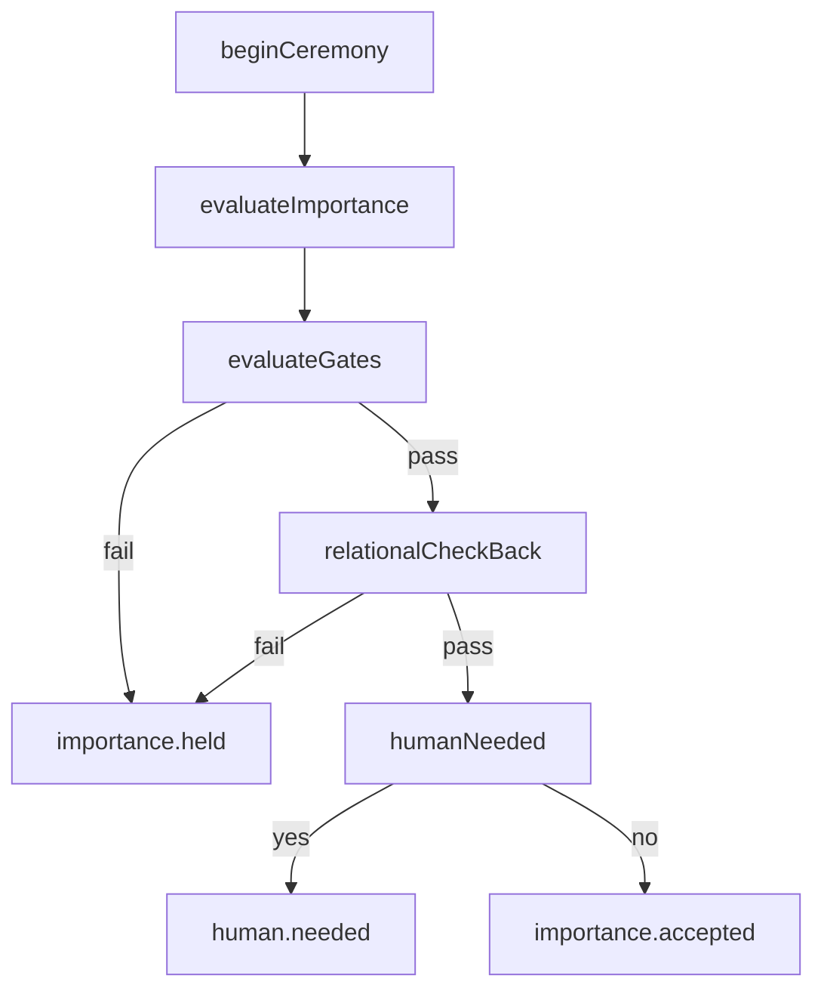

The Fire Keeper is the active coordinator in the suite. It exists because the project does not treat relational integrity as a metric you inspect later; it treats it as a gate that can hold or stop work now.



## What It Is

`medicine-wheel-fire-keeper` centers on the `FireKeeper` class in `src/fire-keeper/src/keeper.ts`. Supporting modules handle:

- gate definitions in `src/fire-keeper/src/gating.ts`
- human escalation in `src/fire-keeper/src/decisions.ts`
- the four-step check-back in `src/fire-keeper/src/check-back.ts`
- extended ceremony state in `src/fire-keeper/src/ceremony-state.ts`
- confidence scoring in `src/fire-keeper/src/trajectory.ts`
- message contracts in `src/fire-keeper/src/messages.ts`

## How It Relates To Other Concepts

The Fire Keeper consumes outputs from other packages:

- ceremony state concepts from `ceremony-protocol`
- directional and relation concepts from `ontology-core`
- structured knowledge such as ImportanceUnits or decomposed work items

It then emits message-shaped outcomes that downstream agents or humans can act on.

## How It Works Internally

The evaluation path in `evaluateImportance` is the important part:

1. Load active ceremony state for an inquiry.
2. Build a `FireKeeperContext`.
3. Run `evaluateGates` across required gating conditions.
4. Run `relationalCheckBack`, which asks four questions.
5. Call `humanNeeded` if trajectory or decision points require escalation.
6. Return `importance.accepted`, `importance.held`, or `human.needed`.

The default gates in `src/fire-keeper/src/gating.ts` are strict and simple:

- Wilson alignment must be at least `0.65`
- OCAP must be verified
- the ceremony cannot be in `resting`

The check-back layer then asks whether the action honors relations, preserves the spirit-body relationship, has directional accountability, and would receive Elder approval. That extra pass matters because it catches problems that raw thresholds miss.

## Basic Usage

```ts
import { FireKeeper, DEFAULT_GATES } from 'medicine-wheel-fire-keeper';

const keeper = new FireKeeper({
  trajectoryThreshold: 0.65,
  permissionTiers: ['observe', 'analyze', 'propose', 'act'],
  gatingConditions: DEFAULT_GATES,
  humanDecisionPoints: [],
});

keeper.beginCeremony('inquiry:api-docs');

const result = keeper.evaluateImportance(
  { id: 'iu-1', title: 'Document public API', direction: 'north' },
  'inquiry:api-docs'
);

console.log(result.type);
```

## Advanced Usage

```ts
import {
  FireKeeper,
  DEFAULT_GATES,
  permissionEscalation,
  circleReview,
  valueDivergenceDetect,
} from 'medicine-wheel-fire-keeper';

const escalation = permissionEscalation('propose', 'act');
console.log(escalation.humanRequired);

const divergence = valueDivergenceDetect(0.42, 0.8);
console.log(divergence.suggestedAction);

const state = keeper.checkCeremonyState('inquiry:api-docs');
if (state) {
  console.log(circleReview({ ceremonyState: state }));
}
```

<Callout type="warn">`FireKeeper` is not a general task runner. It does not execute code, migrations, or deployments by itself. The class is designed to evaluate and route work, so if you use it as a generic orchestrator and ignore its message contracts, you lose the governance behavior that justifies using it.</Callout>

<Accordions>
<Accordion title="Why the Fire Keeper uses explicit message results">
The class returns union-typed message objects like `importance.accepted`, `importance.held`, and `human.needed` because it is intended to sit between sub-agents and human reviewers. That keeps the orchestration surface stable even if the internal checks change. The trade-off is that calling code has to branch on message type instead of assuming success. In return, downstream systems can log, queue, or replay outcomes without tightly coupling themselves to class internals.
</Accordion>
<Accordion title="Why there are both gates and a check-back protocol">
The gate layer handles hard conditions such as alignment thresholds and ceremony phase. The check-back protocol handles the more qualitative questions that do not reduce cleanly to a number, such as whether the action honors the spirit-body relationship. Using both layers is more work, but it prevents the common failure mode where a technically valid action is still relationally wrong. If you remove one layer, the package becomes noticeably weaker at expressing its own worldview.
</Accordion>
</Accordions>
