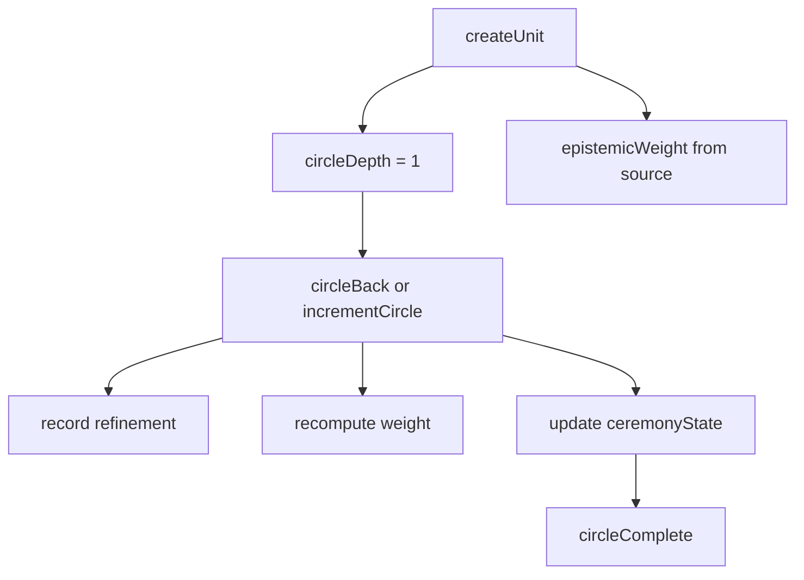

An ImportanceUnit is the workspace's basic unit of knowledge. It exists to solve a problem that plain notes and tasks do not solve: some knowledge carries more authority, some knowledge deepens over repeated circles, and all knowledge should be accountable to something.



## What It Is

`medicine-wheel-importance-unit` adds epistemic modeling on top of the ontology package. The core files are:

- `src/importance-unit/src/types.ts`
- `src/importance-unit/src/unit.ts`
- `src/importance-unit/src/epistemic-weight.ts`
- `src/importance-unit/src/accountability.ts`
- `src/importance-unit/src/circle-tracking.ts`

The package models five things together:

- directional placement
- epistemic source
- epistemic weight
- accountability links
- repeated circling and refinement

## How It Relates To Other Concepts

Importance units sit between modeling and orchestration:

- `prompt-decomposition` can produce candidate tasks and insights.
- `importance-unit` turns those into structured, weighted units.
- `fire-keeper` can then gate or deepen them.
- `relational-index` can index them across Land, Dream, Code, and Vision.

## How It Works Internally

`createUnit` in `src/importance-unit/src/unit.ts` generates an ID, stamps metadata, sets `circleDepth` to `1`, and calls `computeWeight(input.source, 1)`. That weight comes from `BASE_WEIGHTS` in `src/importance-unit/src/epistemic-weight.ts`, where `dream` starts highest at `0.85`, followed by `land`, `vision`, and `code`.

Depth is not linear. The private `depthBonus` function uses logarithmic scaling with a capped `MAX_DEPTH_BONUS` of `0.15`, so early returns matter more than late ones. That is a useful detail because it prevents deep circling from immediately pushing everything to `1.0`.

`circleBack` records a new refinement entry and recalculates weight. `incrementCircle` in `src/importance-unit/src/circle-tracking.ts` also updates `ceremonyState.quadrantsVisited`, which is how the package knows whether a full circle has been completed. `findGaps` in `src/importance-unit/src/accountability.ts` catches isolated units, missing `accountable-to` links, and high-weight units with no deepening relations.

## Basic Usage

```ts
import { createUnit, circleBack, computeWeight } from 'medicine-wheel-importance-unit';

let unit = createUnit({
  direction: 'east',
  source: 'dream',
  summary: 'The river teaches patience through repetition.',
  createdBy: 'firekeeper-agent',
  axiologicalPillar: 'epistemology',
});

unit = circleBack(unit, 'Patience is not delay. It is attention.');

console.log(unit.circleDepth);
console.log(unit.epistemicWeight);
console.log(computeWeight('dream', unit.circleDepth));
```

## Advanced Usage

```ts
import {
  incrementCircle,
  recordRefinement,
  detectDeepening,
  detectStagnation,
  linkAccountability,
  findGaps,
} from 'medicine-wheel-importance-unit';

unit = linkAccountability(unit, {
  targetId: 'community-circle',
  relationType: 'accountable-to',
  description: 'This insight must be reported back.',
});

unit = incrementCircle(unit, 'south');
unit = recordRefinement(unit, 'Moved from intuition into analysis and pattern finding.');

console.log(detectDeepening(unit));
console.log(detectStagnation(unit));
console.log(findGaps([unit]));
```

<Callout type="warn">Use `updateUnit` for small field edits and `circleBack` or `incrementCircle` for deepening. If you overwrite summaries directly when meaning has actually shifted, you erase the refinement trail that the package is designed to preserve.</Callout>

<Accordions>
<Accordion title="Why epistemic weight is source-driven">
The package chooses a source-driven base weight because the code is explicitly encoding a theory of knowledge, not just a priority score. Dream and land start higher than code because `src/importance-unit/src/epistemic-weight.ts` assumes some forms of knowing arrive with stronger authority in this framework. The trade-off is that teams using a different epistemology may disagree with those defaults. If that is your case, treat the weights as a model you may fork or wrap, not as universal truth.
</Accordion>
<Accordion title="Why circling is preserved instead of overwritten">
Repeated returns are the point of the package, not a side effect. `recordRefinement`, `detectDeepening`, and `detectStagnation` all depend on the historical trace of shifts between circles. The trade-off is more data and more discipline, because every meaningful revisit should record what changed. In return, you can tell the difference between genuine learning and mechanical repetition, which a flat note structure cannot do.
</Accordion>
</Accordions>
