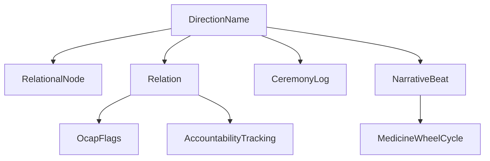

The ontology model is the center of the workspace. It exists so every package can speak the same language for directions, nodes, relations, ceremonies, narrative beats, governance, and accountability.



## What It Is

`medicine-wheel-ontology-core` is a publishable package whose entry point in `src/ontology-core/src/index.ts` re-exports five categories:

- Types from `src/ontology-core/src/types.ts`
- Zod schemas from `src/ontology-core/src/schemas.ts`
- constants from `src/ontology-core/src/constants.ts`
- RDF vocabulary helpers from `src/ontology-core/src/vocabulary.ts`
- in-memory semantic queries from `src/ontology-core/src/queries.ts`

The problem it solves is duplication. Without it, every package would define its own version of a relation, ceremony, or direction and the suite would drift.

## How It Relates To Other Concepts

The ontology feeds every other major concept:

- `ceremony-protocol` depends on `RSISConfig`, `GovernanceConfig`, and `CeremonyPhase`.
- `importance-unit` imports `DirectionName` and then adds epistemic weight and circle depth.
- `prompt-decomposition` enriches its own types with `RelationalObligation`, `CeremonyGuidance`, and `NarrativeBeat`.
- `graph-viz` and `ui-components` use the same direction and node metadata for rendering.

## How It Works Internally

The key design choice is that relationships are not treated as plain edges. In `src/ontology-core/src/types.ts`, `Relation` extends beyond `RelationalEdge` by carrying:

- `obligations`
- `ocap`
- `accountability`
- optional `ceremony_context`
- freeform `metadata`

That makes governance and relational health first-class properties instead of annotations added later.

Runtime validation mirrors the same model. For example, `src/ontology-core/src/schemas.ts` defines `RelationSchema`, `OcapFlagsSchema`, and `AccountabilityTrackingSchema`, which makes ingestion boundaries explicit. Query helpers in `src/ontology-core/src/queries.ts` are intentionally simple and pure: `nodesByDirection`, `relationsForNode`, `traverseRelationalWeb`, `aggregateWilsonAlignment`, `checkOcapCompliance`, and `relationalCompleteness` all work on plain arrays.

## Basic Usage

```ts
import {
  type Relation,
  RelationSchema,
  computeWilsonAlignment,
  checkOcapCompliance,
} from 'medicine-wheel-ontology-core';

const relation: Relation = {
  id: 'rel-1',
  from_id: 'node-a',
  to_id: 'node-b',
  relationship_type: 'kinship',
  strength: 0.9,
  direction: 'north',
  obligations: [{ category: 'human', obligations: ['Report back to community'] }],
  ocap: {
    ownership: 'community',
    control: 'research-circle',
    access: 'community',
    possession: 'community-server',
    compliant: true,
  },
  accountability: {
    respect: 0.9,
    reciprocity: 0.8,
    responsibility: 0.85,
    wilson_alignment: 0.85,
    relations_honored: ['opening-ceremony'],
  },
  metadata: {},
  created_at: new Date().toISOString(),
  updated_at: new Date().toISOString(),
};

RelationSchema.parse(relation);
console.log(computeWilsonAlignment(relation.accountability));
console.log(checkOcapCompliance(relation.ocap));
```

## Advanced Usage

```ts
import {
  traverseRelationalWeb,
  auditOcapCompliance,
  type RelationalNode,
  type Relation,
} from 'medicine-wheel-ontology-core';

const traversal = traverseRelationalWeb(nodes, relations, 'inquiry-1', 2);
const ocapAudit = auditOcapCompliance(relations);

console.log(traversal.visited);
console.log(ocapAudit.non_compliant_count);
```

<Callout type="warn">Do not mix `RelationalEdge` and `Relation` casually. `RelationalEdge` is the light edge shape used by some storage and traversal paths, while `Relation` is the richer first-class relation with OCAP and accountability fields. If your later logic needs governance or Wilson scoring, start with `Relation`.</Callout>

<Accordions>
<Accordion title="Why a broad core package instead of smaller domain-specific packages">
Keeping the model centralized reduces drift, especially for direction names, ceremony phases, and governance fields that would otherwise be copied into every package. The trade-off is that `ontology-core` becomes dense and looks bigger than a typical "types" package. That is a deliberate cost: the package is optimized for coherence across the suite, not for minimal surface area. If you import from the subpaths like `medicine-wheel-ontology-core/types` or `medicine-wheel-ontology-core/queries`, you can still keep your own modules focused while reusing the same source of truth.
</Accordion>
<Accordion title="Why the query helpers stay in-memory and simple">
The helpers in `src/ontology-core/src/queries.ts` operate on arrays, not storage handles or query builders. That keeps them deterministic and usable in Node, tests, the browser, and higher-level packages. The trade-off is performance on very large datasets, because traversal and filtering stay in userland until you move into `relational-query` or a database layer. In practice that split works well: use ontology-core for correctness and portability, then add storage or query packages when you need scale.
</Accordion>
</Accordions>
