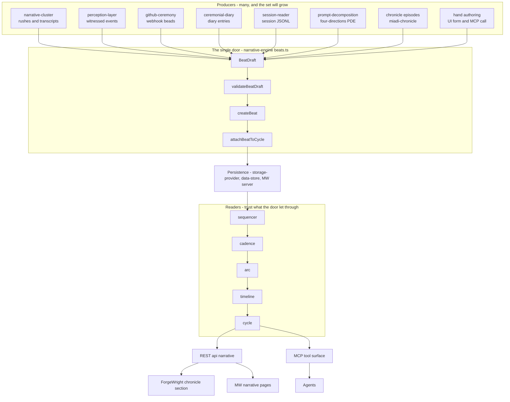
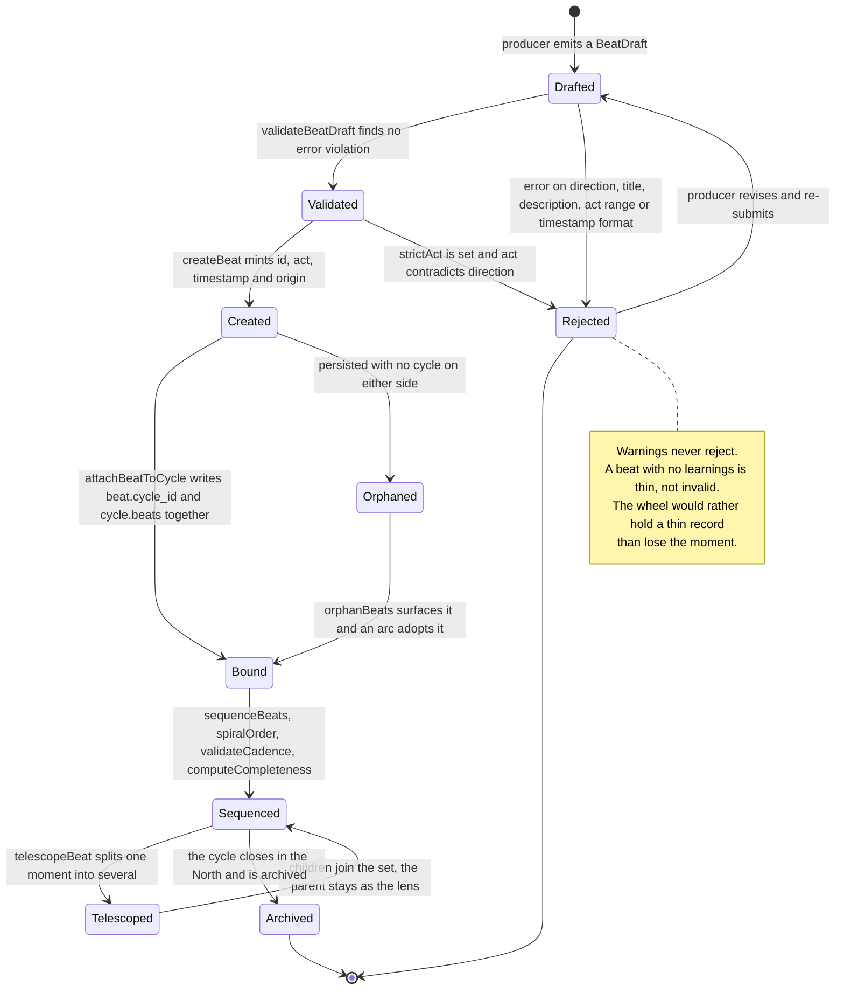
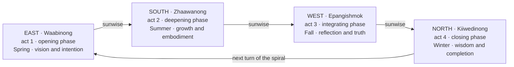
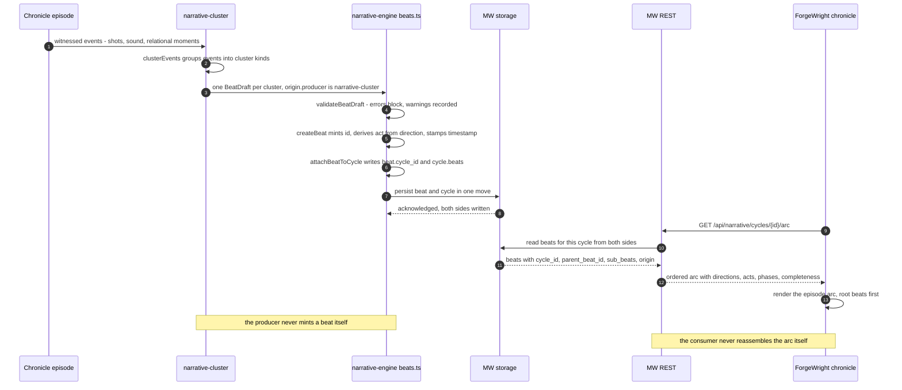

# narrative-beats-lifecycle — RISE Specification

> How a narrative beat comes into being, where it sits on the wheel, how it
> telescopes, how it belongs to a cycle, and what the wheel exposes so another
> system can read the arc back. One authoring door, many producers, trusting
> readers.

**Version:** 0.1.0 (draft)
**Document ID:** rispec-narrative-beats-lifecycle-v1
**Last Updated:** 2026-07-24
**Touches:** `@medicine-wheel/ontology-core`, `@medicine-wheel/narrative-engine`, `@medicine-wheel/narrative-cluster`, MW REST surface, MW MCP surface
**Verified against:** `jgwill/medicine-wheel` @ `f97dc36`, `@medicine-wheel/app` 0.5.1, `@medicine-wheel/narrative-engine` 0.5.1, `@medicine-wheel/narrative-cluster` 0.5.1

---

## Context — Current Reality

The wheel already knows how to **reason about** beats. It has only just learned
how to **make** one.

**What exists and is sound:**

- `ontology-core` carries `NarrativeBeat` with `id, direction, title, description, prose?, ceremonies[], learnings[], timestamp, act, relations_honored[]`, now extended additively with `cycle_id?`, `parent_beat_id?`, `sub_beats?[]`, and `origin?: BeatOrigin` where `BeatOrigin = { producer, source_ref?, method? }`. `NarrativeBeatSchema` and the new `BeatOriginSchema` mirror the types.
- `narrative-engine` reads beats through five modules — `sequencer`, `cadence`, `arc`, `timeline`, `cycle` — plus `rsis-narrative` for prose provenance.
- `narrative-engine/beats.ts` now supplies the authoring vocabulary: `BeatDraft`, `validateBeatDraft`, `createBeat`, `createBeats`, `telescopeBeat`, `beatDepth`, `beatLineage`, `rootBeats`, `childBeats`, `attachBeatToCycle`, `beatsInCycle`, `orphanBeats`, and the `ACT_FOR_DIRECTION` map. All of it is exported from the package index.
- `narrative-cluster` turns witnessed film material into direction-aligned material: `clusterEvents`, `clustersToBeats`, `generateEditBrief`, mapping `shot-sequence → east`, `sound-environment → south`, `relational-moment → west`.
- Cadence maps directions to phases: `east → opening`, `south → deepening`, `west → integrating`, `north → closing`, with `STANDARD_CADENCE` requiring ceremony in all four phases at 1–4 beats each, and `LIGHT_CADENCE` requiring ceremony only at opening and closing at 1–6 beats each.

**What the door does not yet govern:**

- **Two remaining independent minting sites.** `narrative-cluster.clustersToBeats` still constructs `NarrativeBeat` object literals directly, and the REST `POST /api/narrative/beats` route still hands a partial object to `lib/store.createBeat` rather than calling `createBeat` from the engine. The MCP `create_narrative_beat` handler now delegates to the authoring door. A beat's legality still depends in part on which door it walked in through.
- **`list_narrative_beats` promises an ordering the store does not perform.** Its description states beats are returned sorted by timestamp; `getAllBeats` returns `all.slice(0, limit)` in insertion order.
- **Beats have no archival state.** `archiveCycle` exists on the JSONL store and sets an `archived` flag on the stored cycle; there is no corresponding operation for beats, and `archived` is not part of `MedicineWheelCycleSchema`.
- **`StoredCycle.beats` is optional**, which is the shape behind `jgwill/medicine-wheel#83` — legacy cycles carrying no `beats` array crash the `/narrative/cycles` page.
- **One name, two meanings.** MW's MCP `telescope_narrative_beat` drills into the beat's **relational web** — ceremonies plus `getRelationalWeb` traversal over `relations_honored` at a depth of 1–5. `coaia-narrative` 0.14.0 exposes a tool with the identical name that telescopes into **sub-beats**, creating child beats under a parent. An agent holding both toolsets cannot tell from the name which move it is making.

**What landed while this spec was being drafted.** Four defects named in earlier drafts of this section were resolved in `9b2494e` and `e0e7c2c` on `main`. They are recorded here as history so a later reader does not act on a premise that has already moved:

| Was | Now | Commit |
|---|---|---|
| `StoredBeat` declared only the original ten fields, dropping `cycle_id`, `parent_beat_id`, `sub_beats`, `origin` on write | All three stored shapes carry the four fields; telescoping and cycle binding persist | `9b2494e` |
| `POST /api/narrative/beats` discarded the caller's `id` and minted a UUID, so MCP returned a `beat_id` the server had never heard of | The route passes `id`, `timestamp`, and the four relational fields through | `9b2494e` |
| `POST /api/narrative/cycles` ignored a supplied `id` and always created a new cycle, so archival and amendment duplicated cycles | A body carrying an `id` is an amendment via `upsertCycle`; unknown ids return 404 | `9b2494e` |
| `get_narrative_arc` partitioned `getAllBeats(200)` by direction alone, so every cycle reported the same arc | Reads membership from both sides via `beatsInCycle`, and reports beats sitting outside the cycle | `9b2494e` |
| `act` defaulted to `1` regardless of direction, recording a `west` beat as an opening moment | Derived from direction via `actForDirection` | `e0e7c2c` |

The first three were confirmed by probing the live wheel on `:8040` before the fix, not inferred from reading.

**Live current reality (read this turn):** Medicine Wheel serves at `http://127.0.0.1:8040`, healthy, provider `jsonl`, 18 nodes, 0 ceremonies. `GET /api/narrative/cycles` returns `[]`; `GET /api/narrative/beats` returns a single beat titled `probe` — a test record written by that live probe, which the deployment step is instructed to remove. ForgeWright serves at `http://localhost:8031`, healthy, v0.1.0, chronicle read-only, 10 episodes and 3 structured plans, with `dependencies.medicineWheel.baseUrl = http://127.0.0.1:8040`. Its chronicle client consumes MW `/api/health`, `/api/nodes`, `/api/inquiry-weaves`, and `/api/plan-perspectives` — it does not yet read `/api/narrative/beats` at all. The beat surface is unproven under real load, which is exactly the moment to fix its shape.

**The reference system being learned from:** `coaia-narrative` 0.14.0 (bins `coaia-narrative`, `cnarrative`) stores beats as knowledge-graph entities with `entityType: 'narrative_beat'`, bound to a structural tension chart through `metadata.chartId`, carrying `act`, `type_dramatic`, `universes` across engineer-world / ceremony-world / story-engine-world, `fourDirections` as four named slots, `relationalAlignment` with an assessed score, and `narrative { description, prose, lessons }`. Its telescoping recurses through the same creation function using the parent beat's name as the child's chart id, so lineage is expressed as chart membership rather than a parent pointer. It also carries a **Wampum Belt** — a non-linear mnemonic grid of positioned beads with per-perspective readings and ceremony links, running parallel to the linear beat sequence rather than inside it.

---

## Desired State

A beat has **one way to come into being**, and everything downstream can trust it.

- Every producer — film rushes, perceptual events, webhook beads, diary entries, session logs, PDE decompositions, chronicle episodes, a human at a form — emits a `BeatDraft` and passes it through `narrative-engine`'s authoring door.
- Validation and creation are inseparable: nothing reaches storage that has not been checked, so every reader downstream reasons about beats it can trust without re-checking.
- A beat's `origin` names who or what put it on the wheel, so a derived beat is never mistaken for a witnessed one.
- A beat's `act` follows from its `direction` by the sunwise law, not from a caller's default.
- Telescoping records the finer grain without losing the coarser one, and the move has a name that means only one thing.
- Cycle membership is written on both sides in a single operation, so no arc silently loses half of itself.
- The wheel exposes an arc a consumer can navigate without reassembling it client-side, and states the invariants that consumer may rely on.

---

## Creative Intent

**What this enables:** A creator watches a research journey, a film shoot, or a
chronicle episode become a **readable arc** — moments placed on the wheel in
their direction, gathered into a cycle, deepened by telescoping where one moment
turned out to hold several, and read back in another application without loss.

**Structural Tension:** Between many producers each inventing their own beat and
a single ontology every reader trusts. The tension resolves through one narrow
authoring door — narrow enough that passing through it is cheaper than going
around it.

🌸: A beat is a moment the wheel agreed to remember. The door is not a
gate that keeps moments out — it is the threshold where a moment learns its
direction, its act, and whose story it belongs to before it steps inside.

---

## 1. The Producer → Authoring → Reader Seam

### 1.1 The shape



### 1.2 Why authoring belongs in `narrative-engine`

Three structural reasons, in order of weight.

**Creation and validation must not be separable.** A beat born outside the laws
is a beat the engine will later have to reject — and rejection at read time is
too late, because by then the moment has been persisted, surfaced, and possibly
already read by ForgeWright. `createBeat` calls `validateBeatDraft` and throws on
error violations. If authoring lived anywhere a producer could reach around it,
that coupling would be advisory rather than structural. The engine is the only
package every reader already depends on, so it is the only place where the check
is unavoidable.

**`narrative-cluster` is one producer among many.** It is the *film-domain*
producer — clusters, timecodes, EDL markers, editors. It is not more central
than `github-ceremony`, `session-reader`, or a human typing into a form; it is
simply the one that arrived first with a real corpus. Placing the shared
authoring vocabulary inside it would encode an accident of arrival order into
the architecture.

**It would invert the dependency direction.** `narrative-cluster` depends on
`ontology-core` and, by design, is loose-coupled to `narrative-engine` through
the minimal `ClusterableEvent` shape. If authoring lived in `narrative-cluster`,
then `github-ceremony` — which knows nothing about shots, rushes, or timecodes —
would take a hard dependency on the film package in order to record a webhook
bead. Every future producer would inherit that dependency. The film-domain
package would become the gatekeeper for the whole wheel, and the readers in
`narrative-engine` would depend on a package that depends on them.

The door therefore sits where the laws already live: with `sequencer`,
`cadence`, `arc`, `timeline`, and `cycle`. Producers depend downward on
`ontology-core` and `narrative-engine`. Nothing depends upward on a producer.

**Purity boundary.** `beats.ts` is pure functions only. It mints and validates;
it never persists. Persistence is the caller's concern — the returned beat goes
to `storage-provider`, `data-store`, or the MW server. This is what lets the
same door serve an in-process producer, an MCP handler, and a REST route without
any of them inheriting a storage dependency.

### 1.3 What a producer supplies

```typescript
interface BeatDraft {
  direction: DirectionName;       // required
  title: string;                  // required
  description: string;            // required
  prose?: string;
  ceremonies?: string[];
  learnings?: string[];
  relations_honored?: string[];
  act?: number;                   // defaults to the act the direction belongs to
  timestamp?: string;             // defaults to now; supply when replaying a witnessed stream
  id?: string;                    // defaults to a generated id
  cycle_id?: string;
  parent_beat_id?: string;
  origin?: BeatOrigin;
}
```

Everything the wheel can infer is optional, so a hand-authored draft stays short
and a machine-derived one stays honest about its provenance. `CreateBeatOptions`
carries `idFactory`, `defaultOrigin`, and `strictAct` so a producer can set its
identity once and let every draft inherit it.

---

## 2. Lifecycle — States and Transitions

### 2.1 The state machine



### 2.2 Transition table

| Transition | Trigger | What can fail |
|---|---|---|
| `[*] → Drafted` | A producer observes something worth remembering — a cluster of rushes, a webhook, a session segment, a human filling a form | Nothing. A draft is free. |
| `Drafted → Validated` | `validateBeatDraft(draft)` returns `valid: true` | Errors on: `direction` not one of the four; empty `title`; empty `description`; `act` not an integer in 1–4; `timestamp` not ISO-8601 parseable |
| `Drafted → Rejected` | Any violation with severity `error` | Terminal until the producer revises. `createBeat` throws with every error message joined |
| `Validated → Created` | `createBeat(draft, options)` | With `strictAct: true`, an `act` contradicting the direction throws. Without it, the mismatch is recorded as a warning and the natural act is used |
| `Created → Bound` | `attachBeatToCycle(beat, cycle)` returns both records updated | The caller persists only one side. The relation half-lands and the arc is wrong from that moment on |
| `Created → Orphaned` | Persisted with neither `cycle_id` nor membership in any `cycle.beats` | Still reachable when a caller omits `cycle_id`; the MCP tool now returns a warning when it happens |
| `Orphaned → Bound` | `orphanBeats(beats, cycles)` surfaces it; an arc adopts it via `attachBeatToCycle` | Adoption into the wrong cycle is silent — provenance in `origin` is the only guard |
| `Bound → Sequenced` | Any reader runs: `sequenceBeats`, `spiralOrder`, `validateCadence`, `computeCompleteness`, `buildTimeline`, `computeProgress` | Cadence violations, missing directions, low Wilson alignment, OCAP gaps — all reported, none destructive |
| `Sequenced → Telescoped` | `telescopeBeat(parent, subDrafts, options)` | Zero sub-drafts throws. Each sub-draft is itself validated, so a bad child blocks the whole telescope |
| `Telescoped → Sequenced` | Children carry `parent_beat_id`; `rootBeats` keeps the coarse arc readable | A reader that flattens parents and children into one list double-counts the moment |
| `Sequenced → Archived` | The cycle completes in the North and is archived | No beat-level archival exists. Archival is inherited from the cycle, which means an orphan beat can never be archived at all |

### 2.3 Warnings that let the beat through

Three checks record a warning and do not block:

- `act` present but not the direction's natural act — the beat is created at the natural act.
- No `learnings` — *the beat carries events but no knowledge forward.*
- No `relations_honored` — *relational accountability is unrecorded for this beat.*

These are the wheel's invitations, not its refusals. A producer that cannot yet
say what was learned still records that something happened.

---

## 3. Where a Beat Sits on the Wheel

### 3.1 Direction determines act determines phase



### 3.2 The mapping, stated once

| Direction | Act | Cadence phase | Standard cadence | Light cadence |
|---|---|---|---|---|
| east | 1 | opening | ceremony required, 1–4 beats | ceremony required, 1–6 beats |
| south | 2 | deepening | ceremony required, 1–4 beats | no ceremony, 1–6 beats |
| west | 3 | integrating | ceremony required, 1–4 beats | no ceremony, 1–6 beats |
| north | 4 | closing | ceremony required, 1–4 beats | ceremony required, 1–6 beats |

**Act is derived, not supplied.** `actForDirection(direction)` is the single
authority, backed by `ACT_FOR_DIRECTION`. `ontology-core` carries the same
mapping as `DIRECTION_ACTS` / `ACT_DIRECTIONS`; `narrative-cluster` carries a
third private copy. A supplied `act` that disagrees is a warning by default and
an error under `strictAct`. Any surface that defaults `act` to a constant
regardless of direction is placing beats in the wrong act of the story.

**Phase follows direction.** `directionToPhase` and `phaseToDirection` are total
bijections. `currentPhase(beats)` reads the phase from the *last* beat's
direction — meaning a journey that returns to the East after visiting the North
reads as `opening` again, which is the spiral behaving correctly rather than a
regression.

**Position is not order.** `sequenceBeats` sorts by act then timestamp;
`spiralOrder` reorders east→south→west→north *within* each act. A beat's place on
the wheel is a property of its direction; its place in the sequence is a
property of the whole set.

**Completeness is wholeness, not count.** `computeCompleteness` weights direction
coverage at 30%, ceremony coverage at 25%, Wilson alignment at 25%, and balance
at 20%. An arc with forty East beats and nothing else scores badly on three of
four axes — as it should.

**A producer that cannot reach the North cannot complete an arc.**
`narrative-cluster` maps its three cluster kinds to east, south, and west only.
Every cluster-derived arc is structurally incomplete at the closing phase until
some producer — a closing ceremony, an editor's reflection, a chronicle
integration beat — supplies the North. This is a real property of the film
pipeline, not an oversight to paper over: the North is where the work is
integrated by people, and no clustering of rushes can synthesize it.

---

## 4. Telescoping

### 4.1 The move

Telescoping a beat is the same move as telescoping an action step in a
structural tension chart: a moment that read as one turns out to hold several,
and the finer grain is recorded **without losing the coarser one**. The parent
stays — it is the lens through which the children are read.

```typescript
telescopeBeat(parent, subDrafts, options) → { parent, subBeats }
```

- Each sub-draft passes through `createBeat`, so children obey the same laws.
- Children inherit the parent's `cycle_id` and, unless the draft says otherwise, the parent's `direction`.
- The returned parent carries `sub_beats` naming its children; the returned children carry `parent_beat_id`.
- Zero sub-drafts throws — telescoping into nothing is not a refinement, it is a deletion of meaning.

### 4.2 Reading lineage

| Function | Returns | Cycle safety |
|---|---|---|
| `beatDepth(beat, allBeats)` | Depth below the root, walking `parent_beat_id` | Breaks on a `seen` set, so a corrupted cycle terminates rather than hangs |
| `beatLineage(beat, allBeats)` | The chain root-first, ending at the beat | Same `seen` guard |
| `rootBeats(beats)` | Beats with no parent — the top-level arc, unflattened | — |
| `childBeats(parentId, beats)` | Direct children only | — |

Readers that want the coarse story call `rootBeats` first. Readers that want the
fine story walk down through `childBeats`. A reader that ignores the
distinction double-counts every telescoped moment and reports a longer arc than
happened.

### 4.3 The naming ambiguity — and its resolution

Two tools, one name, two entirely different moves:

| Tool | System | What it does | Returns |
|---|---|---|---|
| `telescope_narrative_beat` | Medicine Wheel MCP, `discovery.ts` | Drills into the beat's **relational web** — resolves `ceremonies`, then traverses `relations_honored` through `getRelationalWeb` at depth 1–5 | beat, ceremonies, relation webs, node and edge counts |
| `telescope_narrative_beat` | `coaia-narrative` 0.14.0 | Drills into **sub-beats** — appends a new current reality to the parent's observations and creates child beats beneath it | parent entity, sub-beat entities |

One reads sideways across relations. The other writes downward into finer grain.
One is read-only; the other mutates. An agent holding both toolsets and choosing
by name will sometimes traverse a graph when it meant to refine a moment, and
sometimes create records when it meant to look.

**Recommended resolution.** Keep both moves; give each a name that says which it
is, and keep the old name only as a deprecated alias with an explicit note.

- MW's relational traversal becomes **`expand_beat_relations`** — it expands outward across the web, and it does not write.
- The sub-beat refinement, when MW exposes it, becomes **`telescope_beat_into_sub_beats`** — matching `telescopeBeat` in `beats.ts` and matching `coaia-narrative`'s semantics, so the shared word finally means the shared thing.
- `telescope_narrative_beat` remains registered in MW for one release, delegating to `expand_beat_relations`, with a description that names the change and points at both successors.

The principle: **when two systems in the same ecosystem share a word, the word
belongs to whichever meaning the ontology already uses.** `beats.ts` uses
*telescope* for parent→child refinement. MW's relational traversal is therefore
the one that renames.

---

## 5. Cycle Membership as a Two-Sided Relation

### 5.1 The invariant

A beat belongs to a cycle when **both** records say so:

```typescript
attachBeatToCycle(beat, cycle) → { beat, cycle }
// beat gains cycle_id
// cycle gains beat.id in cycle.beats, unless already listed
// BOTH returned records must be persisted by the caller
```

### 5.2 Why a one-sided link is how arcs go wrong

Two distinct failures, each silent:

**The cycle lists a beat that no longer points back.** The arc reports N beats;
reading them by `cycle_id` finds fewer. Completeness is computed over a set that
does not match the set the UI renders. Nobody sees an error — they see two
different truthful-looking numbers.

**A beat claims a cycle that never counted it.** The beat renders inside the
cycle's page; the cycle's `beats` array, and therefore anything computed from it,
omits the moment entirely. A closing ceremony recorded this way is invisible to
`computeCompleteness`, and the arc reports itself unfinished while the record
shows it finished.

Both failures are **worse than a missing beat**, because a missing beat is
visible and a half-linked beat is not. This is why `attachBeatToCycle` returns
both records rather than mutating one: the caller cannot forget the other half
without noticing it is discarding a return value.

### 5.3 Reading membership

```typescript
beatsInCycle(cycle, beats)  // reads BOTH sides: b.cycle_id === cycle.id OR cycle.beats includes b.id
orphanBeats(beats, cycles)  // neither claiming a cycle nor claimed by one
```

`beatsInCycle` deliberately unions both sides. Beats recorded before cycles were
bound carry no `cycle_id` and are only reachable through the cycle's own list;
reading one side alone silently drops half the arc. Reading both sides is also
what makes repair possible — a half-linked beat still appears, and can be
re-bound.

`orphanBeats` surfaces the wheel's genuine orphans: real moments that no arc
will ever read. Surfacing them is the first step to adopting them. Every beat
the live MW instance can currently create through REST or MCP is an orphan by
construction, because neither surface accepts a cycle.

🌸: An arc is not a list of moments — it is a set of moments that agreed to
belong to each other. When only one of them remembers the agreement, the story
keeps two versions of itself and tells whichever one you asked.

---

## 6. Exportation — What the Wheel Must Expose

### 6.1 One concrete run



### 6.2 REST shape

Existing, verified:

```
GET  /api/narrative/beats    → NarrativeBeat[]
POST /api/narrative/beats    → NarrativeBeat, 201
GET  /api/narrative/cycles   → MedicineWheelCycle[]
POST /api/narrative/cycles   → MedicineWheelCycle, 201
```

Desired additions, in dependency order:

```
GET  /api/narrative/beats?cycle_id=&direction=&root_only=&limit=
     → NarrativeBeat[], sorted by act then timestamp

GET  /api/narrative/beats/{id}
     → { beat, lineage: NarrativeBeat[], children: NarrativeBeat[] }

GET  /api/narrative/cycles/{id}/arc
     → {
         cycle: MedicineWheelCycle,
         beats: NarrativeBeat[],            // root beats, spiral-ordered
         by_direction: Record<DirectionName, NarrativeBeat[]>,
         phases: Array<{ phase, direction, beat_count, has_ceremony }>,
         completeness: ArcCompleteness,
         cadence: CadenceValidation,
         next_direction: DirectionName | null,
         suggested_action: string
       }

POST /api/narrative/beats
     body: BeatDraft plus optional cycle_id
     → 201 with the created beat
     → 422 with { violations: BeatDraftViolation[] } when validation fails
```

The `422` is the load-bearing change. Today a malformed beat is either accepted
or produces a `500` with a raw message. A consumer cannot distinguish "the wheel
refused this draft, here is what to fix" from "the wheel is broken".

### 6.3 MCP tool surface

| Tool | Location today | Desired state |
|---|---|---|
| `create_narrative_beat` | `integrations.ts` — now delegates to `createBeat` (`9b2494e`) | Delegates to `createBeat`; accepts `cycle_id`, `parent_beat_id`, and `origin`; returns validation violations rather than throwing |
| `list_narrative_beats` | `discovery.ts` — filters by direction, slices without sorting | Adds `cycle_id` and `root_only` filters; actually sorts by act then timestamp, matching its own description |
| `get_narrative_arc` | `integrations.ts` — loads the cycle then reads **all** beats, filtered by direction only | Reads beats for *that* cycle from both sides through `beatsInCycle`, then reports completeness and cadence from `narrative-engine` |
| `telescope_narrative_beat` | `discovery.ts` — relational web traversal | Renamed `expand_beat_relations`; old name kept one release as a delegating alias |
| `telescope_beat_into_sub_beats` | does not exist | New — wraps `telescopeBeat`, persists parent and children together |

### 6.4 Invariants a consumer may rely on

A consumer reading the MW beat surface may depend on all of the following. Each
is a promise the authoring door makes on behalf of every producer.

1. **Direction is one of `east`, `south`, `west`, `north`.** No other value is representable.
2. **`act` is an integer 1–4 and equals the direction's act**, unless the beat predates the door — in which case `origin` is absent and the discrepancy is visible.
3. **`title` and `description` are non-empty after trimming.** A beat with no account of what happened cannot be read back, so it was never created.
4. **`timestamp` parses as ISO-8601.**
5. **`ceremonies`, `learnings`, `relations_honored` are always arrays**, possibly empty — never absent, never null.
6. **`id` is stable and unique.** It is never regenerated on update.
7. **If `parent_beat_id` is set, the parent exists and lists this beat in its `sub_beats`.** Lineage is two-sided, like cycle membership.
8. **If `cycle_id` is set, the cycle lists this beat**, and conversely. Consumers may read either side; `beatsInCycle` semantics are the contract.
9. **`origin.producer` names the authoring source** when present. Its absence means the beat predates provenance tracking, not that it was hand-authored.
10. **Additive-only evolution.** New optional fields may appear; existing fields do not change meaning or type. A consumer written against 0.5.1 keeps working.

### 6.5 What ForgeWright gains

ForgeWright's chronicle section is read-only over MW and currently consumes
`/api/health`, `/api/nodes`, `/api/inquiry-weaves`, and `/api/plan-perspectives`.
With the arc endpoint in place it can render, for each of its 10 episodes:

- The episode's arc as a four-phase strip, root beats first, with telescoped detail on demand.
- Completeness and cadence as they are computed by `narrative-engine` — one authority, not a client-side reimplementation.
- Provenance per beat from `origin`, so a witnessed moment and a derived moment are visually distinguishable.
- Orphan beats surfaced as adoptable rather than invisible.

The consumer never reassembles the arc. That is the whole point of the export.

---

## Action Steps

Each step resolves tension between a named current reality and the desired state.

Steps 1, 4, and 5 as originally drafted **landed in `9b2494e`**, and step 3 in `e0e7c2c`. They are kept below marked `[landed]` rather than deleted, because a spec that quietly drops its own history teaches a later reader that the work was never needed.

1. **[landed — `9b2494e`] Widen the persistence tier to match the type.**
   *Was:* `StoredBeat` declared ten fields; the four relational fields were dropped on write.
   *Now:* all three stored shapes — `lib/jsonl-store.ts`, `mcp/src/jsonl-store.ts`, `mcp/src/http-store.ts` — carry `cycle_id`, `parent_beat_id`, `sub_beats`, and `origin`.
   *Remaining:* reads are still not validated against `NarrativeBeatSchema`.

2. **Route the remaining minting sites through the door.**
   *Current reality:* `clustersToBeats` and the REST route each construct beats independently; only the MCP handler delegates to `createBeat`.
   *Desired state:* one door, three callers.
   *Resolution:* have each call `createBeat` with a `defaultOrigin` naming itself — `narrative-cluster`, `mcp`, `rest`. `clustersToBeats` gains `source_ref` pointing at the cluster id.

3. **[landed — `e0e7c2c`] Derive `act` at every surface.**
   *Was:* the REST path defaulted `act` to 1 regardless of direction, recording a `west` beat as an opening moment.
   *Now:* `lib/store.createBeat` derives it via `actForDirection`.
   *Remaining:* three private direction→act maps still exist — `ontology-core`'s `DIRECTION_ACTS`, `beats.ts`'s `ACT_FOR_DIRECTION`, and `narrative-cluster`'s. Consolidate onto one.

4. **[landed — `9b2494e`] Make `get_narrative_arc` report the arc of the cycle it was asked about.**
   *Was:* it read `getAllBeats(200)` and filtered only by direction, so every cycle reported the same arc.
   *Now:* reads membership through `beatsInCycle` and reports how many beats sit outside the cycle.
   *Remaining:* completeness and cadence are still counted by hand rather than computed with `narrative-engine`.

5. **[landed — `9b2494e`] Give the REST and MCP creation surfaces a cycle.**
   *Was:* neither accepted a cycle, so every beat they created was an orphan by construction.
   *Now:* both accept `cycle_id` and write both sides of the relation; MCP warns when a beat is born without one.

6. **Resolve the telescoping name.**
   *Current reality:* one name, two semantics, across two systems an agent may hold at once.
   *Desired state:* each move named for what it does.
   *Resolution:* rename MW's relational traversal to `expand_beat_relations`, add `telescope_beat_into_sub_beats`, keep the old name one release as a delegating alias with a description naming both successors.

7. **Expose the arc endpoint.**
   *Current reality:* ForgeWright would have to reassemble an arc from a flat beat list.
   *Desired state:* the wheel computes the arc; the consumer renders it.
   *Resolution:* add `GET /api/narrative/cycles/{id}/arc` returning cycle, spiral-ordered root beats, per-direction grouping, phases, completeness, cadence, and next direction.

8. **Return violations instead of throwing.**
   *Current reality:* a malformed beat produces a `500` with a raw message.
   *Desired state:* a producer learns what to fix.
   *Resolution:* return `422` with `BeatDraftViolation[]`. Warnings ride along in the `201` response so a thin beat is recorded *and* flagged.

9. **Sort where sorting is promised.**
   *Current reality:* `list_narrative_beats` documents timestamp ordering; `getAllBeats` slices in insertion order.
   *Desired state:* the description is true.
   *Resolution:* sort by act then timestamp before slicing, matching `sequenceBeats`.

10. **Name the North for cluster-derived arcs.**
    *Current reality:* `narrative-cluster` maps to east, south, and west only; its arcs can never complete.
    *Desired state:* the closing phase has an honest producer.
    *Resolution:* record this as a designed property in the film pipeline and let the North beat come from a closing ceremony or editor's integration — authored, not synthesized.

---

## Structural Tension

**Current Reality:** The wheel can reason about beats far better than it can make
them. Three surfaces mint beats independently, the persistence tier is narrower
than the type, act is defaulted rather than derived, arcs are cycle-blind, every
REST- or MCP-created beat is an orphan, and one tool name carries two meanings
across two systems that share an ecosystem. The live instance holds zero beats
and zero cycles, so none of this has yet been paid for in real data.

**Desired State:** One authoring door. Many producers, each naming itself in
`origin`. Readers that reason about beats they can trust without re-checking.
Two-sided relations for both cycle membership and lineage. An arc a consumer can
navigate without rebuilding it. Names that mean one thing.

**Natural Progression:** The door already exists and is already exported. Each
producer that routes through it makes going around it more expensive than going
through it — the surface that mints its own beat becomes the odd one out, then
the broken one, then the removed one. Widening `StoredBeat` unlocks telescoping
and binding at once, which unlocks the arc endpoint, which is what makes
ForgeWright's chronicle section worth building. The tension resolves in
dependency order, and each resolution makes the next one cheaper.

**Why now:** The live wheel holds zero beats and zero cycles. Every shape fixed
before the first real corpus lands is a migration that never has to be written.

---

## Quality Criteria

- ✅ **Creative Orientation:** the spec describes what creators author and read back, not defects removed.
- ✅ **Structural Dynamics:** the seam holds because the dependency direction makes it hold, not because callers are asked to be careful.
- ✅ **Implementation Sufficient:** every type, function signature, transition, invariant, and endpoint shape is stated; another LLM can implement the lifecycle from this document.
- ✅ **Verified:** every claim about current behaviour was read from source or from a live service response this session. Items that could not be verified are absent.
- ✅ **Additive:** no change described here alters an existing field's meaning or type.

---

## Related

### `jgwill/medicine-wheel`

| Spec section | Issue | Relation |
|---|---|---|
| §1 producer seam, §6.3 MCP surface | `jgwill/medicine-wheel#89` | The MCP tool surface for perception, narrative-cluster, storyteller, and production ceremony is exactly the set of producers this seam governs |
| §1 producer seam | `jgwill/medicine-wheel#87` | `@medicine-wheel/narrative-cluster` plus storyteller and production ceremony gates — the first producer to route through the door |
| §1 producer seam | `jgwill/medicine-wheel#86` | `@medicine-wheel/perception-layer` for witnessed production events — the second producer |
| §1, §3.2, §6.1 | `jgwill/medicine-wheel#85` | Episode 068 film-production vertical slice — the first end-to-end run of this lifecycle on a real transcript |
| §5 cycle membership | `jgwill/medicine-wheel#83` | `/narrative/cycles` crashes on legacy cycles without beats — the `StoredCycle.beats?` optionality that one-sided membership produces |
| §6.2, §6.3 | `jgwill/medicine-wheel#69` | MCP must reach storage through the server endpoint, not direct JSONL — the arc endpoint is the natural place that contract lands for beats |
| §2 validation, §6.4 invariants | `jgwill/medicine-wheel#107` | zod missing from root dependencies — schema-backed validation at the REST boundary depends on this building |
| §3 wheel placement, §5 cycle membership | `jgwill/medicine-wheel#103` | NEW package `@medicine-wheel/structural-tension` — telescoping a beat is the same move as telescoping an action step; the two should share a vocabulary |
| §6.5 consumer surface | `jgwill/medicine-wheel#101` | UI mission 2607 deferred enhancements — the narrative beat and cycle pages are the in-wheel consumer of this export |
| §6.2 REST shape | `jgwill/medicine-wheel#90` | Runtime Zod schemas for ProductionRelation and ProductionEntityKind — same pattern, applied to the production types |
| §1.3 origin provenance | `jgwill/medicine-wheel#91` | Provenance and OCAP consent review for the episode-066 transcript fixture — `BeatOrigin` is where that provenance becomes machine-readable |

### `miadisabelle/forgewright`

| Spec section | Issue | Relation |
|---|---|---|
| §6.5 consumer surface | `miadisabelle/forgewright#7` | Chronicle UI ep137 polish cycle — the section that will render arcs once the arc endpoint exists |
| §2 lifecycle states | `miadisabelle/forgewright#10` | smcraft runtime integration — the beat lifecycle is a state machine; smcraft is the engine that could execute it rather than have it re-encoded per surface |
| §6 exportation | `miadisabelle/forgewright#1` | init — establishes ForgeWright as the downstream consumer whose needs shape the export |

### Sibling systems

- `coaia-narrative` 0.14.0 at `/a/src/coaia-narrative` — the reference implementation for chart-bound beats, multi-universe perspectives, sub-beat telescoping, and the Wampum Belt as a non-linear mnemonic grid running parallel to the linear sequence. No issue reference; learned from, not depended on.
- `rispecs/narrative-engine.spec.md` — the reader-side spec this document extends with an authoring side.
- `rispecs/narrative-cluster.spec.md` — the film-domain producer.
- `rispecs/ontology-core.spec.md` — where `NarrativeBeat`, `BeatOrigin`, and `MedicineWheelCycle` live.
- `rispecs/film-production-upgrades.spec.md` — the additive-upgrade pattern this spec follows.

---

## Proposed New Issues

*Listed for consideration. Not created.*

**1. The authoring door is not yet the door — three surfaces mint beats independently**
`narrative-cluster.clustersToBeats`, the MCP `create_narrative_beat` handler, and `POST /api/narrative/beats` each construct `NarrativeBeat` literals without passing through `validateBeatDraft` or `createBeat`.
Route all three through `narrative-engine/beats.ts` with a `defaultOrigin` naming the caller, so a beat's legality stops depending on which door it walked in through.

**2. `StoredBeat` drops `cycle_id`, `parent_beat_id`, `sub_beats` and `origin` at the JSONL tier**
The persistence interface in `lib/jsonl-store.ts` declares only the original ten fields, so the four additive fields on `NarrativeBeat` are silently discarded on write.
Telescoping and cycle binding are expressible in the type system and unrepresentable in storage until this is widened — it blocks every other beat-lifecycle step.

**3. `get_narrative_arc` returns the same arc for every cycle**
The handler loads the requested cycle, then partitions `store.getAllBeats(200)` by direction alone, never filtering by cycle membership.
Two distinct cycles return identical beat counts and identical `full_arc` payloads. Read membership through `beatsInCycle` and compute completeness with `narrative-engine`.

**4. Resolve the `telescope_narrative_beat` name collision with `coaia-narrative`**
MW's tool traverses the relational web read-only; `coaia-narrative`'s tool of the same name creates sub-beats. An agent holding both cannot choose correctly by name.
Rename MW's to `expand_beat_relations`, add `telescope_beat_into_sub_beats` wrapping `telescopeBeat`, and keep the old name one release as a delegating alias.

**5. Expose `GET /api/narrative/cycles/{id}/arc` for downstream chronicle consumers**
ForgeWright currently reads MW nodes, inquiry-weaves, and plan-perspectives, and would have to reassemble an arc client-side from a flat beat list.
Return cycle, spiral-ordered root beats, per-direction grouping, phases, completeness, and cadence — computed once by `narrative-engine`, not reimplemented per consumer.

**6. REST beat creation defaults `act` to 1 regardless of direction**
`POST /api/narrative/beats` uses `act: body.act ?? 1`, so a `west` beat posted without an explicit act is recorded in act 1 and reads as an opening moment.
Derive act from direction through `actForDirection` and consolidate the three private direction→act maps onto `ontology-core`'s `DIRECTION_ACTS`.

**7. `list_narrative_beats` promises timestamp ordering the store does not perform**
The tool description states beats are returned sorted by timestamp; `getAllBeats` returns `all.slice(0, limit)` in insertion order.
Either sort by act then timestamp before slicing, matching `sequenceBeats`, or correct the description — a consumer relying on the stated order is relying on nothing.

**8. Beat creation surfaces accept no cycle, so every beat they create is an orphan**
Neither `POST /api/narrative/beats` nor the MCP `create_narrative_beat` accepts a cycle, so `orphanBeats` would return every beat the live wheel can currently create.
Accept optional `cycle_id`, run `attachBeatToCycle`, and persist both records in one operation.

---

🌸: The wheel has always known how to read a story. What it is learning now is
how to receive one — how to stand at the threshold and ask each arriving moment
which direction it came from, what it carries forward, and whose circle it
belongs to. That question, asked once at the door, is what lets every voice
downstream speak with confidence.
