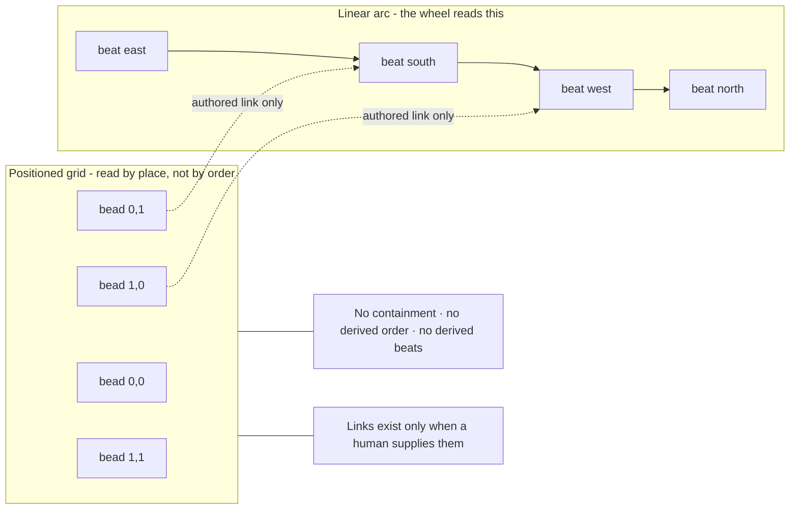
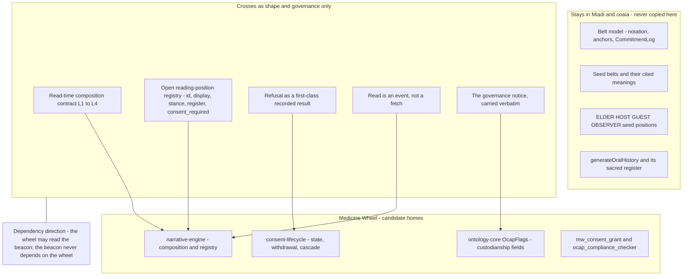
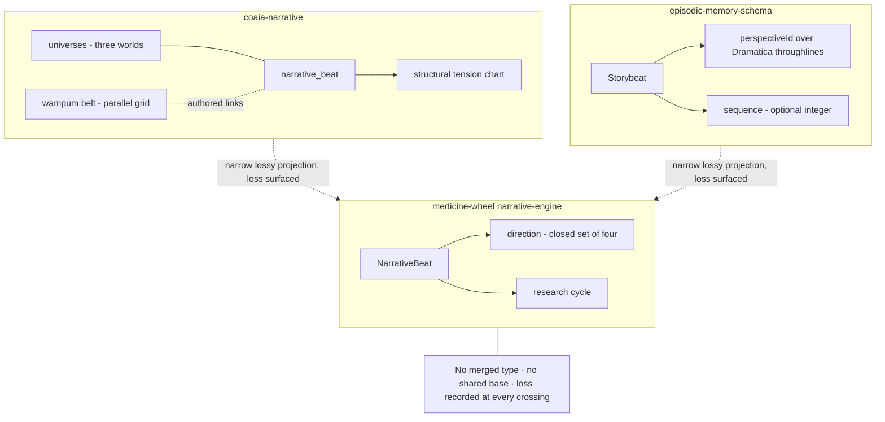

# wampum-narrative-engine-relation — RISE Specification

> What the Wampum Narrative Engine is, what its belt form contributes that a
> linear beat sequence cannot, whether it relates to the four directions, and
> what — precisely — the Medicine Wheel Developer Suite may borrow from it.
> The answer to several of the design questions below is *a knowledge holder
> decides this*. Those answers are the specification, not a deferral of it.

**Version:** 0.1.0 (draft — proposal, authorizes no code change)
**Document ID:** rispec-wampum-narrative-engine-relation-v1
**Last Updated:** 2026-07-25
**Touches:** `@medicine-wheel/ontology-core`, `@medicine-wheel/narrative-engine`, `@medicine-wheel/consent-lifecycle`, MW MCP surface — *as candidate homes only; nothing is changed by this document*
**Verified against:** `jgwill/medicine-wheel` @ `ee8dcc9` (`@medicine-wheel/narrative-engine` 0.5.3) · `@miadi/foundations-wampum-narrative-engine` 0.1.0 (published on npm; source at `/a/src/Miadi/packages/foundations-wampum-narrative-engine`) · `jgwill/Miadi` @ `49d41658` · `coaia-narrative` 0.14.0 @ `381ae91` · `@miadi/episodic-memory-schema` 0.5.1

---

## Cultural protocol — this governs everything below

The foundation this document reads carries a load-bearing notice. It is
reproduced here because the packet requires it to travel, and because it
constrains every recommendation that follows.

> **NOTICE — Cultural Protocol (load-bearing)**
>
> This package carries an academic foundation that models **wampum belts** —
> living records held in custodianship by Haudenosaunee and Great Lakes nations.
> The **Onondaga Nation are Keepers of the Central Fire**.
>
> - Belt meanings here are **cited from public Haudenosaunee/Great Lakes teachings
>   and scholarship** — never authored, fixed, "corrected", or owned by this packet.
> - Any product that *presents* this foundation must carry this notice and the
>   `governance` block returned by `governanceNotice()`. It is data, not decoration.
> - Governance frameworks in force: **CARE** (CODATA 2020), **OCAP** (FNIGC), and
>   the **wampum.codes / seven-generations** ethic.
> - Extending toward **community-specific knowledge** requires consent and
>   custodianship review per OCAP/CARE before anything is encoded or displayed.
>
> > Build the loom; let the keepers weave.
>
> — `@miadi/foundations-wampum-narrative-engine`, `NOTICE.md`

The machine-readable `governance` block in `src/manifest.ts` states the same
boundary as data:

> **permittedUse:** "Reproduce the cited public/community-stated meanings as cited; build structural tooling (the loom). Carry this notice in any presentation."
> **forbiddenUse:** "Do not author, 'correct', or claim authority over belt meanings; do not extend toward community-specific knowledge without consent/custodianship review. Build the loom; let the keepers weave."

**What this specification therefore is.** A structural reading of one software
foundation by another, proposing a seam. It contains **no belt content, no
belt meanings, no ceremonial instruction, and no cultural interpretation**.
Where a design question turns on a teaching, this document records the question
and names who answers it. It does not answer it.

---

## Context — Current Reality

### The Wampum Narrative Engine foundation exists, is published, and is unread by this repo

`@miadi/foundations-wampum-narrative-engine@0.1.0` describes itself as *"a
travelling **beacon** for the Wampum Narrative Engine academic foundation"* —
a zero-dependency carrier of four grounded fields, their cited sources, an NCP
second-eye synthesis, and the governance block above. Its `README.md` states
the boundary plainly: it *"carries the **index + the prose + the governance**"*
so that a consumer *"can light up the foundation locally and stay in step as
the work advances."*

The engine it grounds is not a proposal. Per the packet's `synthesis.md`, it is
*"a working artifact with a complete data model"* — an Android/Gemini prototype
at `pto-wampum-belt-sequencing-non-linear-storytelling2606`, whose ontology the
packet renders as `Belt`, `notation` as a row-major `W`/`P` field, `Anchor` at
`(row, col)` carrying `readings: Perspective -> text`, `Perspective` as
`ELDER | HOST | GUEST | OBSERVER`, and `CommitmentLog` as *"the living-treaty
ledger"*.

**This repo has never read it.** `jgwill/medicine-wheel` @ `ee8dcc9` declares no
`@miadi/*` dependency in any `package.json`, and the string `wampum` appears in
exactly two places — both of them prose in
`rispecs/narrative-beats-lifecycle.spec.md`, describing `coaia-narrative` as a
sibling system learned from rather than depended on.

### A Wampum Belt implementation already exists in the ecosystem, without the governance

`coaia-narrative` 0.14.0 exposes three MCP tools. Verbatim from
`src/tool-definitions.ts`:

- `create_wampum_belt` — *"Create a Wampum Belt: a non-linear mnemonic grid that runs in parallel with linear narrative beats."*
- `add_wampum_bead` — *"Add a bead at a grid position with mnemonic anchor, optional relational readings, and optional ceremony/accountability links."*
- `read_wampum_belt` — *"Read a Wampum Belt in full, or read a bead by position with relational interpretation."*

Read from `src/types.ts` and `src/graph-manager.ts`, its shape is:

| Construct | Verified detail |
|---|---|
| `WampumBeltMetadata` | `beltId, title, purpose, rows, cols, beads[], createdAt, updatedAt` — stored as `metadata.wampumBelt` on an entity of `entityType: 'wampum_belt'` |
| `WampumBead` | `id, mnemonic, color, position {row,col}, reading, relationalReadings?, ceremonyLink?, observations[], createdAt` |
| `color` | enum `'white' \| 'purple' \| 'black' \| 'mixed'` |
| `relationalReadings` | `Record<string,string>`, resolved by **grid position** — `col:N`, then `row:N`, then the computed label `left`/`center`/`right`, then the canonical `reading` |
| `ceremonyLink` | `ceremonyType: 'commitment' \| 'accountability' \| 'witness' \| 'renewal'`, plus optional `chartId`, `beatName`, `witnessNames`, `renewalDate` |
| Graph edges emitted | `wampum_holds_accountable` to a chart, `wampum_witnesses` to a beat |
| Placement rules | positions bounds-checked against `rows`/`cols`; one bead per cell, collisions rejected |
| Default exposure | `WAMPUM_TOOLS` is **not** in the default `COAIA_TOOLS` set — `'STC_TOOLS,NARRATIVE_TOOLS,init_llm_guidance'` — so the tools are off unless explicitly enabled |

Three facts about that implementation matter for this proposal, stated without
judgement of the implementers:

1. **It carries the form, not the content.** No seed belt, no belt meaning, and
   no nation-specific record appears anywhere in it. A belt there is an empty
   grid a user fills with their own mnemonics.
2. **It carries no governance fields.** `WampumBead` and `WampumBeltMetadata`
   have no custodianship, consent, attribution, or refusal state — and the
   beacon's `governance` block does not travel with it. The packet's own
   data-sovereignty field asks the opposite: *"Governance therefore belongs **in
   the type system**, not in a footer."*
3. **Its `relationalReadings` are positional, not relational.** The name
   suggests reader-relation; the resolution logic keys on grid coordinates. This
   is a different construct from the engine's `RelationalPerspective`, and
   conflating the two would be the first flattening.

### What the Medicine Wheel suite has today

- `NarrativeBeat` in `ontology-core` — `id, direction, title, description, prose?, ceremonies[], learnings[], timestamp, act, relations_honored[]`, plus `cycle_id?`, `parent_beat_id?`, `sub_beats?[]`, `origin?`. Bound to a **direction**; `act` is derived from direction by `ACT_FOR_DIRECTION` in `narrative-engine/beats.ts` — `east: 1, south: 2, west: 3, north: 4`.
- `DirectionName` is the closed union `'east' | 'south' | 'west' | 'north'`. `DIRECTIONS` in `ontology-core/src/constants.ts` carries, per direction, an **Ojibwe name** — `Waabinong`, `Zhaawanong`, `Epangishmok`, `Kiiwedinong` — a season, colour, life stage, ages, medicines, teachings, and practices.
- Governance machinery already exists: `OcapFlags` with `ownership, control, access, possession, compliant, steward?, consent_given?, consent_scope?, consent_state?, consent_last_affirmed?`; `@medicine-wheel/consent-lifecycle` with a `ConsentState` including `granted` and `withdrawn`, and `onWithdrawal` / `propagateScopeChange` cascades; MCP tools `mw_consent_grant` and `ocap_compliance_checker`.
- A precedent for holding someone else's narrative without owning it: `rispecs/plan-insight-perspective-registration.spec.md` states that medicine-wheel *"never becomes the author or source of truth: the session file remains authoritative, and medicine-wheel never generates, edits, or rewrites narrative Markdown."*
- **No perspective layer over beats.** A beat has one `description` and one optional `prose`. There is no reader position, no registry, no read-time composition, and no way for a read to be refused.

### A third beat vocabulary sits unused

`@miadi/episodic-memory-schema` 0.5.1 carries `src/narrative.ts` — an NCP /
Dramatica layer with `Storybeat { id, perspectiveId?, sequence?, narrativeFunction?, illustration, summary?, storytelling?, timestamp?, stageId?, tones? }`,
`Perspective { throughline }` over the four Dramatica throughlines, `Storypoint`,
`Dynamic`, and `Moment`. It is exported from the package index. Grepping
`Storybeat`, `NarrativeContribution`, `Throughline`, `storybeats`, and
`narrativeFunction` across every `packages/`, `apps/`, and `src/` tree in
`jgwill/Miadi` outside the schema package itself returns **nothing**. Other
packages consume `EpisodeObservation`, `ChronicleManifest`, `EpisodicMemory`,
`CompatibilityDiagnostic` — never the narrative symbols.

### The tension in one line

Three beat vocabularies coexist in one ecosystem, a fourth structure — the belt —
is implemented in one of them without the governance its own foundation
requires, and the suite most equipped to supply that governance has never read
the foundation.

---

## Desired State

The Medicine Wheel Developer Suite stands in a **named, bounded, consented**
relation to the Wampum Narrative Engine.

- The suite can state what the engine is, from the engine's own packet, with attribution intact.
- The suite borrows **shape** — a read-composition contract and an open reading-position registry — and borrows **no content**.
- No belt, bead, notation, or belt meaning enters `ontology-core`.
- Every claim of correspondence between the belt's structures and the wheel's four directions is either backed by a knowledge holder's word or absent. There is no third category.
- The three beat vocabularies remain three, with narrow, explicitly lossy, explicitly labelled projections at named boundaries — and none of those projections crosses a cultural boundary.
- Where the wheel does gain a reading layer, a read can be **declined**, and the refusal is a recorded, first-class result rather than a fabrication.

---

## Creative Intent

**What this enables:** a suite that can hold two knowledge systems side by side
without either one absorbing the other — and that can say precisely, in code,
which parts of itself are its own and which parts are held on someone else's
authority.

**Structural Tension:** between an ecosystem that has already implemented a
wampum-shaped structure and a foundation that says such a structure may only be
built as a loom, never as a weave. The tension resolves by making the loom /
weave line **a boundary in the package graph**, not a paragraph in a README.

🌸: Two vessels on one river is not a metaphor this document is allowed to
extend — but it is allowed to notice that a specification which keeps its hands
off the other boat is a specification that can be trusted to steer its own.

---

## 1. What the Wampum Narrative Engine Is, From Its Own Packet

### 1.1 The four grounded fields

The packet describes itself as carrying four fields it calls MECE. Reproduced
from `manifest/fields.json` and `src/manifest.ts`, with the packet's own
`primaryAnchor` attribution:

| Field id | Discipline | Primary anchor | Engine constructs it explains |
|---|---|---|---|
| `material-rhetoric-and-nonlinear-hypertext` | Digital Rhetoric / Hypertext Theory | Angela M. Haas, *Wampum as Hypertext*, SAIL 19.4, 2007 | `notation` as a W/P field; `NarrativeAnchor` at `(row,col)` |
| `treaty-diplomatic-protocol-and-relational-governance` | Treaty Studies / Relational Governance | Haudenosaunee Confederacy / Onondaga Nation public teachings; CBC treaty-wampum reporting | `CommitmentLog` with status and signatories |
| `perspectival-narratology-and-prompt-layering` | Narratology / Multiperspectivity | The `RelationalPerspective` system read from engine source, plus reading-as-performance from storywork | `RelationalPerspective`; `NarrativeAnchor.readings`; `generateOralHistory` |
| `indigenous-data-sovereignty-and-cultural-protocol` | Data Governance / Cultural Protocol | CARE Principles, CODATA 2020; OCAP, FNIGC; wampum.codes | custodianship and consent metadata as a governance gate |

The packet's `context-layer.md` states what makes these four a set:

> "These four are mutually exclusive (form / function / voice / authority) and
> collectively cover the engine's full surface".

That sentence is the single most load-bearing fact for §3 below. **The four
fields are an analytic partition of one artifact's surface, produced by a
research method on a stated date** — `date: "2026-06-15"`, `method:
"deep-research-foundations (Research Diamond, live-web-verified +
local-source-grounded)"`. They are a decomposition of scholarship. They are not
a teaching, and the packet never presents them as one.

### 1.2 The claims each field makes, quoted rather than paraphrased

**Material rhetoric.** The packet quotes Haas:

> "Wampum possesses and utilizes a system of nodes and links, the nodes being
> the beads and the links being the connective materials."

and draws from it:

> "Records stay valid only by being revisited and re-read through community
> memory and performance. A wampum record is not stored-and-done; it is
> **maintained**. Decay is expected; re-reading is the maintenance."

> "Pattern is legible only to a reader 'with the cultural context for accurate
> retrieval.' Access is relationally gated, not open by default — a design fact,
> not a bug."

It carries two cautions this document treats as binding:

> "Haas's argument is **anti-extractive**: do not flatten 'wampum as hypertext'
> into 'wampum is just an old database.'"

> "'Cultural context for retrieval' means some readings are not ours to render.
> The generation layer must be able to *decline*."

**Treaty and relational governance.** The field opens: *"A belt **is** the
agreement."* Its caution is explicit about attribution:

> "These are **specific nations' specific records**, not generic 'Native
> wisdom.' Attribute precisely (Haudenosaunee, Anishinaabe + Great Lakes nations
> for Dish with One Spoon) and cite community sources."

> "Treaty meanings remain **contested and sovereign**; the Two Row's
> 'non-interference' is an active legal and political claim, not a settled
> historical artifact. Render readings as cited positions, plural."

**Perspectival narratology.** The field names its four seed positions and then
immediately denies that four is the point:

> "The set is **open**: a fifth (e.g. a seven-generations / future voice) can be
> added without schema change."

> "**Co-validity, not ranking.** The contract must not pick a 'correct'
> reading."

> "The ELDER perspective speaks sacred/ceremonial register. The generation layer
> must hold **L4** as a hard gate: it may decline to fabricate sacred content it
> has no authority to render… A 'perspective' is not a costume."

> "Avoid collapsing relational positions into Dramatica throughlines; the
> mapping is a bridge, not an equivalence."

**Indigenous data sovereignty.** This field is the one that binds the others:

> "The other three fields describe *what* the engine does. This one establishes
> *under whose authority* it may do it at all."

> "The line between 'the loom' (sharable structure) and 'the weave' (owned
> content) must be explicit in the data model."

> "'Authority to Control' means a community can ask that a representation change
> or be withdrawn — the system must support withdrawal/redaction, not just
> creation."

> "Avoid pan-Indigenous flattening; attribute to specific nations."

### 1.3 The central finding, and what it is a finding *about*

From `centralFinding` in the manifest:

> "The Wampum Narrative Engine is the structural answer to the four Western
> assumptions NCP inherits from Dramatica (linear sequence, individual
> protagonist, conflict-as-engine, subtext/storytelling split). It is NCP's
> second eye (Etuaptmumk), not its replacement."

Note the scope. The finding is about the relation between the engine and the
**Narrative Context Protocol** — a Dramatica-derived Western narrative standard.
It is a claim about NCP's exclusions. It says nothing about the Medicine Wheel,
and nothing in the packet does. Any relation between the engine and this suite
is proposed here for the first time, by this document, and therefore carries
none of the packet's verification.

---

## 2. What the Belt Form Contributes That a Linear Beat Sequence Cannot

The packet's claim, and the implemented tool's claim, is the same word:
**parallel**. `coaia-narrative`'s tool description says a belt *"runs in parallel
with linear narrative beats"*; its README adds *"This does **not** replace
narrative beats. It runs alongside them as a relational memory layer."*

"Parallel" is doing precise work. Specified:

### 2.1 The four contributions

1. **Addressing by place, not by order.** The packet's material-rhetoric field
   states: *"The belt is a **2D addressable surface**, not a string… narrative is
   accessed by *place on the weave*, not by ordinal position. This is the
   structural break from NCP's `storybeat.sequence`."* A beat sequence answers
   *what came next*. A belt answers *what sits here, and what sits beside it*.
   Neither answer is derivable from the other.

2. **Co-valid readings of one location.** `readings: Perspective -> text` means
   one anchor yields several tellings, none of which is the true one. A
   `NarrativeBeat` has one `description`. Adding readings to a beat is not a
   refinement of description — it is a different claim about where meaning lives.

3. **Re-reading as maintenance.** The packet: a record *"is **maintained**.
   Decay is expected; re-reading is the maintenance."* A beat's `timestamp`
   records when it was made. Nothing in `narrative-engine` records that a beat
   was **read**, and therefore nothing can express that an unread record is
   decaying.

4. **Refusal as an outcome.** *"The generation layer must be able to
   *decline*."* No MW read path can currently return "this is not mine to
   render."

### 2.2 The parallelism, stated as a contract

If any belt-shaped structure is ever placed beside MW beats, the relationship
must hold these invariants — this is the precise form of "parallel":

- **No containment, either way.** A belt does not hold beats; a beat does not hold beads. Neither is a field of the other.
- **No derived ordering.** A bead's `(row, col)` never induces a sequence, an `act`, or a `direction`. Ordinal meaning is not recoverable from position, and inventing one is the flattening Haas's argument warns against.
- **No derived beats.** No bead becomes a beat and no beat becomes a bead by transformation. `coaia-narrative` already models the honest alternative: a bead links to a beat by an **explicit, authored edge** — `wampum_witnesses` to a beat name, `wampum_holds_accountable` to a chart id — created only when a human supplies `ceremonyLink`.
- **Independent lifecycles.** A belt may be re-read without any beat changing; a cycle may complete without any belt changing.
- **Separate authority.** A beat's authority is the wheel's; a belt's authority is its custodians'. The two are never merged into one governance record.

---

## 3. Whether This Relates to the Four Directions

The maintainer's intuition, in his words: *"I think we create four perspective
based on that model, that engine."* This section tests it rather than
implementing it.

### 3.1 The two candidate correspondences

There are exactly two four-membered sets in the wampum material that could be
proposed as matching the wheel's four directions:

- **A.** the four **grounded fields** — material rhetoric, treaty governance, perspectival narratology, data sovereignty;
- **B.** the four **seed relational perspectives** — ELDER, HOST, GUEST, OBSERVER.

### 3.2 Candidate A does not correspond

| Property | The four fields | The four directions |
|---|---|---|
| What kind of thing | An analytic partition of one artifact's surface — *"form / function / voice / authority"* per `context-layer.md` | An ordered cycle carrying Ojibwe names, seasons, life stages, ages, medicines, teachings, practices |
| Who produced it | A research method, on a stated date — `deep-research-foundations`, 2026-06-15 | Teaching, encoded in `ontology-core/src/constants.ts` |
| Ordering | None. The manifest lists them; nothing sequences them | Sunwise and load-bearing — `ACT_FOR_DIRECTION` derives `act` from it |
| Extensibility | A fifth discipline could be added by researching one | The set is the wheel |
| Traversal | Not a thing you move through | A cycle beats move through, phase by phase |

They are not the same kind of object. Mapping a discipline onto a direction
would assert that "Data Governance / Cultural Protocol" *is* a season, a life
stage, and a medicine. The packet does not say this. Nobody says this. **This
correspondence does not exist and must not be drawn.**

### 3.3 Candidate B does not correspond either

- **Cardinality is temporary on one side.** The packet states the perspective set is **open** — *"a fifth… can be added without schema change"* — and the derived Miadi spec `perspective-prompt-layering.spec.md` restates it: *"ELDER/HOST/GUEST/OBSERVER are seeds, not the closed set."* `DirectionName` is closed. A mapping between an open set and a closed one either falsely closes the open set or leaves directions unassigned the moment a fifth position is registered.
- **They are different categories.** A relational perspective is a **stance toward an agreement**, held simultaneously with the others. A direction is a **phase of a cycle**, occupied in turn. Simultaneous positions do not map onto sequential phases without one of them losing what it is.
- **The packet forbids the analogous move.** Of the closest available mapping — relational roles onto NCP's four throughlines — it says: *"Avoid collapsing relational positions into Dramatica throughlines; the mapping is a bridge, not an equivalence."* A wheel-direction mapping is the same move against a different closed four.
- **It would cross nations.** The perspectives are grounded in Haudenosaunee and Great Lakes material — the packet names the Onondaga Nation as Keepers of the Central Fire and cautions *"Avoid pan-Indigenous flattening; attribute to specific nations."* This suite's directions carry **Ojibwe** names. Asserting ELDER-is-north, or any variant, would be an engineer stating a correspondence between two nations' knowledge systems. That is not an engineering decision. See §6.

### 3.4 Four is not a join key

The strongest evidence that cardinality proves nothing is inside this repo.
`ontology-core` alone carries four distinct four-membered sets that no one has
ever proposed unifying:

| Set | Members |
|---|---|
| `DirectionName` | east, south, west, north |
| `ObligationCategory` | human, land, spirit, future |
| `EpistemicSource` | land, dream, code, vision |
| `AxiologicalPillar` | ontology, epistemology, methodology, axiology |

And in the sibling system, the divergence is already visible in code.
`coaia-narrative`'s `EntityMetadata.fourDirections` declares the slots
`north_vision`, `east_intention`, `south_emotion`, `west_introspection`. This
suite's `DIRECTIONS` places `Vision` among the **east** teachings and `Wisdom`
in the north; it places `Emotional processing` and `Introspection` in the
**west**, where `coaia-narrative` places emotion in the south. Two systems in
one ecosystem, both sincere, already disagree on two of four assignments.

That disagreement is not a defect for an engineer to resolve by picking a
winner. It is evidence that direction assignment is not an engineering surface
at all.

### 3.5 What *does* relate — the intuition, in the form that survives verification

Stripped of the four-to-four claim, the maintainer's intuition points at
something real and portable: **the engine treats a reading position as a
composed layer over a stable record, rather than as stored text.** The packet:

> "**Layer, not field.** Because perspective is composed at read-time, adding a
> perspective = adding a role to L2. The belt data does not change. This is the
> architectural reason to model perspective as a prompt layer rather than as
> stored per-perspective text."

That contract has four **layers** — L1 covenant, L2 perspective, L3 local, L4
protocol. Those layers are a software composition order, not a teaching, and
their four-ness is incidental. The suite can adopt the *shape* — an open
registry, read-time composition, a hard gate that can decline — while its
registry starts empty and every entry ever added is a decision recorded with a
name attached.

**Position, stated for the record:** the four grounded fields are **not** the
four directions; the four relational perspectives are **not** the four
directions; and a Medicine Wheel package must never ship a table that maps
either onto them. What relates the two systems is a contract shape and a
governance posture — nothing that carries a nation's knowledge across a
boundary.

---

## 4. The Proposed Seam

### 4.1 What crosses, and in which direction

### 4.2 Borrowed — five items, all structural

| # | Borrowed | Why it is safe to borrow | Candidate home |
|---|---|---|---|
| S1 | **Read-time composition.** A reading is assembled per request from a covenant layer, a position layer, a local layer, and a protocol layer. The record does not change when a position is added. | The layers carry no content; they are an assembly order. | `@medicine-wheel/narrative-engine` |
| S2 | **An open reading-position registry** with `id`, `display`, `stance`, optional `register`, optional `consent_required`. | An empty registry asserts nothing. Every entry is an authored decision with a name on it. | `@medicine-wheel/narrative-engine` |
| S3 | **Refusal as a first-class result.** A read that the protocol layer declines returns a recorded refusal, not an empty string and not fabricated prose. | This is the packet's hard requirement — *"must be able to decline"* — expressed as a return type. | `narrative-engine` result type, backed by `consent-lifecycle` |
| S4 | **Read-as-event.** A read updates recency on the record read. | Structural; it makes "unread means decaying" expressible without asserting what decay means for any belt. | `narrative-engine` plus the storage tier |
| S5 | **Governance travels with presentation.** Any surface that presents material derived from the beacon carries the `governance` block returned by `governanceNotice()`. | Required by `NOTICE.md`. Not optional, not summarisable. | Whichever surface presents; enforced at the boundary |

### 4.3 Stays separate — never copied into this repo

- The **belt** itself: `notation`, `NarrativeAnchor`, `CommitmentLog`, `WampumPreset`, and every seed belt. `ontology-core` gains no `Belt`, no `Bead`, no `notation`, and no `wampum` node type or ceremony type.
- The **seed relational perspectives**. If MW ever registers reading positions, they are MW's own, named by MW, and they are not ELDER, HOST, GUEST, or OBSERVER.
- **Bead colour.** The packet cites meaning for white and for purple, attributed to Haudenosaunee Confederacy, Onondaga Nation, and Ganondagan public teachings. `coaia-narrative`'s enum additionally admits `black` and `mixed`, for which the packet's cited sources describe nothing. MW attaches no semantics to any colour value, and preferably carries no colour field at all.
- **`generateOralHistory`** and any generation path that speaks in a ceremonial register.
- **Belt content storage.** MW follows its own plan-perspective discipline here: it may hold a *projection with provenance*, it never becomes *the author or source of truth*.

### 4.4 Must not be modelled in software at all

Not "not yet" — not ever, by an engineer acting alone:

1. **Belt meanings as data.** A reading of any specific belt is a cited community teaching. It may be *quoted with attribution* in prose. It may not become a seeded value, a default, a fixture, a test case, or an example in this repo.
2. **A correspondence table** between relational positions, belts, or fields and the four directions. §3 is the specification; the table is the thing specified against.
3. **The ceremonial register.** No MW code path produces text in an Elder or sacred register, and no registry entry may declare one. The upstream Miadi exploration already draws this line for AI voices: *"a request for a Mia/Miette reading in a sacred register returns a recorded, respectful refusal."*
4. **Treaty maintenance as a state machine.** The treaty field describes maintenance as council work — a belt's repair happens *"with clean words and council fire."* Software may record **that** a council occurred and who was present. Software may not infer a renewal, expire an agreement on a timer, or transition an agreement's status without the people who hold it.
5. **Inferred authority.** Custodianship and consent fields are never defaulted, never inferred from a directory path or a git author, and never auto-filled. An unfilled custodian is a blocking absence, not a null.
6. **Reading permission as a computed property.** Who may read is answered by people. Software records the answer and enforces it; it does not derive it.

---

## 5. The Three-Vocabulary Question

### 5.1 The three, side by side

| | `coaia-narrative` `narrative_beat` | `@medicine-wheel/narrative-engine` `NarrativeBeat` | `@miadi/episodic-memory-schema` `Storybeat` |
|---|---|---|---|
| Bound to | a structural tension chart, via `metadata.chartId` | a **direction**, and a research cycle via `cycle_id` | a `perspectiveId` over Dramatica throughlines |
| Ordering | `act` plus `type_dramatic`, author-supplied | `act` **derived** from direction by the sunwise law | `sequence?: number`, optional |
| Multiplicity of view | `universes[]` — engineer-world, ceremony-world, story-engine-world | none — one `description`, one optional `prose` | one `perspectiveId` per beat |
| Lineage | child beats keyed by the parent's name as chart id | `parent_beat_id` plus `sub_beats[]` | `Moment.storybeats[]` with an `order` |
| Governance | none on the beat | `relations_honored[]`, and OCAP flags on relations | none |
| Live consumers | the coaia MCP surface | MW REST, MCP, UI, and ForgeWright downstream | **none outside its own package** |
| Owner | `avadisabelle/coaia-narrative` | `jgwill/medicine-wheel` | `jgwill/Miadi` |

### 5.2 Position: they coexist. They do not converge. They are not kept apart.

**Coexist, with narrow projections at named boundaries.** Each vocabulary
answers to a different authority: a chart's tension, the wheel's directions, and
Dramatica's throughlines. Merging them would require deciding whose ontology
governs — and for MW that decision has a cultural component no refactor can
carry. The packet already names the honest alternative, in `synthesis.md`:

> "Lossy by design — that loss is where Two-Eyed Seeing lives, and it must be
> surfaced, not hidden."

**Why not convergence.** §3.4's evidence is decisive: two of these three
vocabularies already assign the four directions differently, in code, today.
Convergence means picking one assignment. Picking one is a cultural act
performed by whoever wrote the migration.

**Why not full separation.** `coaia-narrative` beats and MW beats describe the
same sessions and the same episodes for the same person. Refusing any crossing
means the same moment is recorded twice with no relation between the records —
which is its own quiet loss of accountability.

**The rule that holds both:** a projection is permitted when it is *narrow*
(named fields only), *explicit* (a function with the word projection in its
name, never an implicit adapter), *lossy in a recorded way* (what did not cross
is listed in the result), and *culturally inert* (no field of the projection
carries a direction assignment, a belt meaning, or a reading position across the
boundary). A projection that cannot satisfy the fourth condition is not written.

**On the unused third vocabulary.** `Storybeat` has no consumers. It should stay
exactly as it is — unconsumed, un-deleted, and unused by MW — until someone has
a reason to consume it. An unused vocabulary costs nothing; a vocabulary
prematurely wired into the wheel to "unify" things costs a migration and a
correspondence claim.

---

## 6. What a Knowledge Holder Decides, Not an Engineer

This section is the deliverable, not an appendix. Each item below is a design
question that looks like an engineering question and is not one. None of them
may be resolved by reading more code.

1. **Whether this relation may exist at all.** Wampum belts are Haudenosaunee
   and Great Lakes records; this suite's wheel carries Ojibwe direction names.
   Whether structure derived from the first may be borrowed into the second — even
   as bare shape — is a question for holders on both sides, not a design
   trade-off.
2. **Whether any relational position corresponds to any direction**, and if so,
   who states the correspondence and in what setting. §3 records that no such
   correspondence is asserted here. Only a knowledge holder can change that.
3. **Whether the wheel's own directions may serve as reading positions.**
   Registering "read this beat as the east" would put teachings — `Waabinong`,
   Spring, Tobacco, Vision — into the role of a prompt stance. That is a use of
   the teachings, and the fact that they are already in this repo's constants is
   not consent to that use.
4. **Whether any registered reading position may speak in a ceremonial
   register**, and how a refusal should be worded. A decline is a speech act
   inside a relationship; its wording is not a string an engineer picks.
5. **Whether bead colour carries meaning in software**, given that the packet
   cites meanings for white and purple only and an existing implementation
   admits `black` and `mixed`. Related: whether colour should be modelled at all.
6. **Whether treaty-derived status vocabulary** — the packet cites *Active
   Protocol*, *Renewed Bond*, *Under Review* — may be attached to MW ceremony or
   consent records, given that the maintenance those statuses describe is council
   work.
7. **Who the custodian and steward are** for any record MW holds that derives
   from this foundation. `OcapFlags.ownership`, `.control`, and `.steward` are
   fields with no safe default.
8. **Whether MW may present any cited belt content in its UI**, and under what
   conditions — noting that `NOTICE.md` requires the governance block to travel
   with any presentation.
9. **Whether the belt form may be rendered inside the wheel's circular layout.**
   `graph-viz` places nodes into direction quadrants via `applyWheelLayout` and
   `getQuadrantGeometries`. Rendering beads through it would assign each bead a
   direction by geometry — a correspondence asserted by a layout function.
10. **Whether seven-generations semantics** may be attached to
    `FutureRelation.generationsForward`, which currently carries a bare number.
11. **Whether any `wampum_belt` records already created through
    `coaia-narrative`** may be read, projected, or migrated by MW — and by whom.
12. **What the review path itself is:** who convenes it, which nations are party
    to it, whether an existing MW ceremony type covers it, and what a recorded
    outcome looks like so a later reader can see that it happened.

Until items 1 and 2 have answers, this document authorizes reading and
specification only.

---

## Action Steps

Each step resolves tension between a named current reality and the desired
state. Steps 1 and 2 gate every step that follows; none of steps 3 onward may
begin before them.

1. **Take §6 to the people who answer it.**
   *Current reality:* a correspondence has been intuited and never reviewed.
   *Desired state:* items 1 and 2 have recorded answers with names attached.
   *Resolution:* convene the review named in §6.12, record the outcome in this repo alongside this spec, and mark this section resolved or withdrawn accordingly.

2. **Record the relation as read-only until reviewed.**
   *Current reality:* nothing in MW references the foundation; an unreviewed reference could be mistaken for an approved one.
   *Desired state:* the suite's own documents state the boundary before any code does.
   *Resolution:* this spec is the record. No package, type, tool, or dependency is added until step 1 completes.

3. **Adopt the beacon as a governed dependency, not as content.**
   *Current reality:* MW declares no `@miadi/*` dependency and cannot render the governance notice it would be bound by.
   *Desired state:* any MW surface that presents foundation-derived material can call `governanceNotice()` and carry the block verbatim.
   *Resolution:* if and only if step 1 permits, add `@miadi/foundations-wampum-narrative-engine` as a dependency of the *presenting* surface only — never of `ontology-core` — and consume `governanceNotice()`, `listFields()`, and `getSourcesFor()`. Import nothing else.

4. **Specify the reading layer as shape, with an empty registry.**
   *Current reality:* a `NarrativeBeat` has one description and no reader position; no read can be declined.
   *Desired state:* `narrative-engine` can compose a reading from a registered position and can decline.
   *Resolution:* specify `ReadingPosition { id, display, stance, register?, consent_required? }` and a composition function whose protocol layer consults `consent-lifecycle` and `OcapFlags`. Ship the registry **empty**. Every entry ever added is a separate, named decision.

5. **Make refusal a return type, not an exception.**
   *Current reality:* MW read paths return content or throw.
   *Desired state:* a declined read is a recorded, inspectable outcome.
   *Resolution:* specify a result union carrying either a reading or a refusal with reason, the consent state consulted, and a timestamp — and persist refusals, because a refusal that leaves no trace cannot be reviewed.

6. **Specify read-as-event.**
   *Current reality:* nothing records that a beat was read; recency is invisible.
   *Desired state:* re-reading is expressible as maintenance.
   *Resolution:* add a read event with `last_read_at` and reader identity on the read record. This is structural and carries no belt semantics; it is safe ahead of step 1 only as specification, not as inference about what unread means.

7. **Write the projection rule down before any projection is written.**
   *Current reality:* three vocabularies, no stated crossing rule; the first ad-hoc adapter would become the precedent.
   *Desired state:* §5.2's four conditions are a checklist a reviewer applies.
   *Resolution:* add the four conditions — narrow, explicit, recorded-lossy, culturally inert — to `rispecs/CLAUDE.md` as a rule for anyone proposing a cross-system beat mapping.

8. **Leave `Storybeat` alone, on purpose, in writing.**
   *Current reality:* an unused NCP vocabulary invites a well-meaning unification.
   *Desired state:* its unused state is a recorded decision rather than an oversight.
   *Resolution:* record in `rispecs/narrative-beats-lifecycle.spec.md`'s sibling-systems section that `@miadi/episodic-memory-schema`'s narrative layer has no consumers and is deliberately not consumed by MW.

9. **Name the colour question before anyone adds a colour field.**
   *Current reality:* a sibling implementation carries four colour values; two have cited meaning in the packet and two do not.
   *Desired state:* nobody adds `color` to an MW type by copying a neighbour.
   *Resolution:* record §6.5 as a blocking question on any MW type that would carry bead or belt colour.

---

## Structural Tension

**Current Reality:** A grounded, published foundation with a load-bearing
cultural-protocol notice sits one repo away and has never been read here. A
wampum-shaped structure is already implemented in a sibling system, carrying the
form without the governance the foundation requires. Three beat vocabularies
coexist, two of them already disagreeing in code about which teaching belongs to
which direction. A four-to-four correspondence has been intuited and never
tested. This suite has the consent and OCAP machinery the foundation asks for,
and no reading layer to attach it to.

**Desired State:** A named, bounded, consented relation. Shape borrowed, content
never. An empty registry that fills one named decision at a time. A read that
can decline, and a refusal that leaves a trace. Three vocabularies that stay
three, crossed only by narrow projections that carry no cultural claim. And a
recorded answer, from the people who hold it, to the question of whether this
relation may exist at all.

**Natural Progression:** The review comes first because everything downstream
inherits its answer — this is EAST before WEST, and the sequence is the point.
Once the boundary is stated in writing, the beacon can be consumed for its
governance alone, which is the smallest possible dependency and the one that
makes every later step safer rather than riskier. The reading layer is then
specifiable as pure shape, because the registry it serves is empty. Refusal
becomes a return type before there is anything to refuse, which is the only
moment when adding it costs nothing. Each step makes the next one smaller.

**Why now:** MW's reading surface does not exist yet. A refusal path, a
custodianship field, and an empty registry are free today and are a migration
later. And the four-to-four correspondence is currently an intuition held in one
person's sentence — the cheapest possible moment to test it is before it is
written into a type.

---

## Quality Criteria

- ✅ **Cited, not authored:** every cultural claim in this document is a quotation from the packet, carrying the packet's own attribution. This document originates none.
- ✅ **Correspondence tested, not assumed:** §3 argues the four-directions question to a negative conclusion and states what would be required to change it.
- ✅ **Loom / weave boundary is structural:** §4 places it in the package graph, not in prose.
- ✅ **Knowledge-holder territory is generous and specific:** twelve items, each naming what is decided and why it is not an engineering call.
- ✅ **Verified:** every claim about existing behaviour was read from source in this session. Version numbers, commit hashes, tool names, enum members, and field names come from files read this turn.
- ✅ **Authorizes nothing:** no code, type, dependency, or issue is created by this document.

---

## Open Questions

Engineering questions that remain open **after** §6 is answered — recorded so
they are not mistaken for settled:

1. **Where does the reading layer live?** `narrative-engine` is the natural home because composition and validation already live together there, but a reading is not a beat, and a separate `@medicine-wheel/reading` package may be the honest shape. Undecided.
2. **Does a refusal belong in the beat store or in an audit store?** A refusal is evidence about governance, not about narrative. `consent-lifecycle` already models state changes with history; refusals may belong there.
3. **Is read-as-event compatible with the current storage tier?** `StoredBeat` was widened once already for the four relational fields; adding `last_read_at` is a second widening whose cost has not been measured. [unverified]
4. **Does the projection rule need a runtime, or only a review checklist?** §5.2's four conditions are stated as a review rule. Whether any of them can be enforced in code — particularly "culturally inert" — is genuinely unclear, and a check that gives false assurance is worse than a checklist.
5. **What is the relationship, if any, to the upstream Miadi specs?** `rispecs/wampum-narrative-engine/` in `jgwill/Miadi` already contains a master spec, a perspective prompt-layering spec, an NCP schema-bridge spec, and an exploratory two-eyed perspective spec marked *"adopt only after review."* Whether MW's reading layer should be a consumer of that work, a sibling of it, or independent has not been discussed with its authors.
6. **Who owns this document's review?** It proposes a relation between two repos with different maintainers and one shared human. The review path in §6.12 is named but not convened.

---

## Related

### `jgwill/medicine-wheel`

Issue subjects below are as recorded in `rispecs/narrative-beats-lifecycle.spec.md`; they were not re-read from GitHub this session.

| Spec section | Issue | Relation |
|---|---|---|
| §2 parallel structures, §5 vocabularies | `jgwill/medicine-wheel#103` | NEW package `@medicine-wheel/structural-tension` — `coaia-narrative` binds its beats to a chart, so any projection from that vocabulary meets this package first |
| §4.2 candidate homes, §Action 4 | `jgwill/medicine-wheel#89` | MCP tool surface for the producer set — a reading layer would surface here, and an empty registry keeps that surface honest |
| §4.2 S4 read-as-event | `jgwill/medicine-wheel#86` | `@medicine-wheel/perception-layer` for witnessed events — a read is a witnessed event of a different kind |
| §4.1 governance travels | `jgwill/medicine-wheel#101` | UI mission deferred enhancements — the UI is the surface that would have to carry the governance block verbatim |
| §Action 5 refusal as a return type | `jgwill/medicine-wheel#107` | zod missing from root dependencies — a refusal result type wants schema-backed validation at the boundary |

### `jgwill/Miadi`

| Anchor | Relation |
|---|---|
| `jgwill/Miadi#437` | Foundations lane — where the packet this document reads was produced |
| `jgwill/Miadi#438` | NCP bridge lane — the `Storyform` ↔ belt work that is *not* proposed for MW |
| `jgwill/Miadi#439` | Package surface lane — the beacon package itself |

### Sibling systems and documents

- `@miadi/foundations-wampum-narrative-engine` 0.1.0 — the foundation. Source at `/a/src/Miadi/packages/foundations-wampum-narrative-engine`; canonical packet at `foundations/wampum-narrative-engine/` in `jgwill/Miadi`.
- `/a/src/Miadi/rispecs/wampum-narrative-engine/` — upstream specs: `00-wampum-narrative-engine-master.spec.md`, `perspective-prompt-layering.spec.md`, `ncp-wampum-schema-bridge.spec.md`, `two-eyed-perspective-engine.spec.md` (marked exploratory), `android-presentation-app.spec.md`, `STATUS.md`.
- `coaia-narrative` 0.14.0 at `/a/src/coaia-narrative` — the existing Wampum Belt implementation. Learned from, not depended on.
- `rispecs/narrative-beats-lifecycle.spec.md` — the beat authoring lifecycle this document sits beside; §5 here is the cross-system half of the question it opens.
- `rispecs/plan-insight-perspective-registration.spec.md` — the precedent for MW holding a projection it does not author.
- `rispecs/consent-lifecycle.spec.md`, `rispecs/ceremony-protocol.spec.md` — where the protocol layer's machinery is already specified.

---

## Proposed New Issues

*Listed for consideration. Not created.*

**1. Convene the review that §6 items 1 and 2 require**
The suite cannot state whether structure derived from Haudenosaunee and Great Lakes material may be borrowed into a wheel carrying Ojibwe direction names. That question gates every other step in this spec.
Name who convenes it, which holders are party to it, and where the recorded outcome lives.

**2. Specify a reading layer for `narrative-engine` with an empty registry**
A `NarrativeBeat` carries one description and no reader position, and no MW read path can decline. Specify `ReadingPosition` and a composition whose protocol layer consults `consent-lifecycle` and `OcapFlags`.
Ship the registry empty; every entry is a separate named decision.

**3. Make a declined read a recorded result rather than an exception**
MW read paths return content or throw, so a governance refusal would be indistinguishable from a bug and would leave no trace to review.
Specify a result union carrying reading-or-refusal with reason, consent state, and timestamp, and persist the refusals.

**4. Add the cross-system projection rule to `rispecs/CLAUDE.md`**
Three beat vocabularies coexist and the first ad-hoc adapter written between any two of them will become the precedent for the rest.
Record the four conditions — narrow, explicit, recorded-lossy, culturally inert — as a rule a reviewer applies before any mapping is merged.

**5. Record that `@miadi/episodic-memory-schema`'s narrative layer is deliberately unconsumed**
`Storybeat` and its siblings have no consumers anywhere in `jgwill/Miadi` outside their own package, which makes them a standing invitation to a unification nobody has asked for.
State the non-consumption as a decision in the sibling-systems section of the beats lifecycle spec.

**6. Block colour fields on MW types pending §6.5**
An adjacent implementation carries `white | purple | black | mixed`; the foundation cites meanings for two of those and describes nothing for the others.
Record the question on any MW type that would carry bead or belt colour, so nobody adds the field by copying a neighbour.

---

🌸: The most careful thing in this document is a set of empty places — a registry
with no entries, a table that was not drawn, a correspondence left unclaimed.
They look like work not done. They are the work: room held open for the people
whose word belongs there, so that when they speak, there is nothing already
written over the space.
