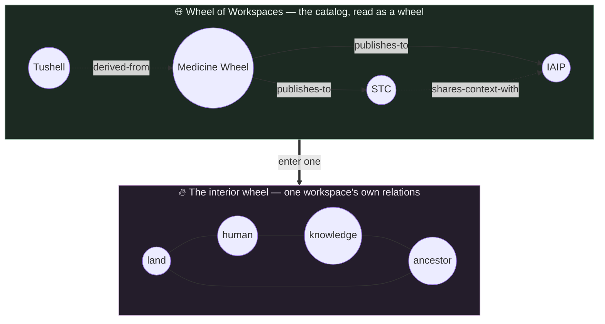

# Display Analysis — The Medicine Wheel, Read By Workspace

> Short analysis, as requested: what changes on screen once the wheel is drawn from one workspace
> instead of from everything. This is consequence, not specification — the contracts live in
> `workspace-scope-and-access.spec.md` and `workspace-configuration.spec.md`.

**Document ID:** rispec-workspace-display-analysis-v1
**Status:** Analysis
**Last Updated:** 2026-09-06

---

> [!NOTE]
> **Now applies — see `STATUS.md` (2026-09-06).** This was written assuming a running server that
> redraws when you switch workspace, and then filed under a deferred slice. That assumption is the
> requirement, so the analysis stands. Length and the unrequested "Wheel of Workspaces" remain open
> under `jgwill/medicine-wheel#136` `G7`.
>
> **Still not settled — `STATUS.md` §0.** The requirement was stated a third time after this banner
> was written: **one storage location, many workspaces inside it.** That is not the several-locations
> model this folder was corrected to, and the two are still both present. The requester's words:
> *"we did not understood each other on the definition of the workspace."*

## The one-sentence consequence

Today the wheel's shape is a property of *the deployment*; after scoping it becomes a property of
*the workspace* — so switching workspaces does not re-label the wheel, it **redraws** it, and every
surface that assumed one stable shape has to learn to be redrawn.

🎡 *The metaphor:* right now the wheel is a **mural** — painted once, always the same, and the
switcher is a nameplate screwed to the frame. After scoping it is a **sand painting** — made fresh
for the work at hand, different in every lodge, and unmade when you leave. Murals need a frame;
sand paintings need a floor, a rite for making, and a rite for sweeping away.

---

## Surface by surface

| Surface | Today | After scoping | The new failure to design against |
| --- | --- | --- | --- |
| `app/page.tsx` — the wheel | One global distribution across four directions | Distribution of *this* workspace | A young workspace has 3 nodes and two empty quadrants; it must still read as a wheel, not as a broken one |
| `app/graph` — force/circular graph | One node set, one saved layout key | Node set and layout both per workspace | Switching mid-drag; a saved layout whose nodes no longer exist |
| `app/nodes`, `app/relations` | Global lists | Scoped lists | Counts and pagination change under the user; empty is now normal |
| `app/ceremonies` | Global ceremony log | Scoped log | A ceremony's meaning is local; comparing counts across workspaces is not comparing like with like |
| `app/narrative` (beats, cycles) | Legacy store, unscoped | Must be scoped or explicitly global | If beats stay global while nodes scope, the narrative layer bleeds across wheels — visibly, and confusingly |
| `app/accountability` | Global obligations | Scoped, plus relation-level obligations from ERD 2 | Two obligation sources on one page; provenance must be visible |
| `components/navigation.tsx` | Selection is local `useState` | Active context above the router, in the URL | A shared link must carry the workspace or it shows the wrong wheel to the recipient |
| `components/direction-panel.tsx` | Direction reference + counts | Reference stays global, counts scope | The same panel now mixes global and scoped data — the seam must be legible |

---

## The five real design problems

### 1. Colour is already spoken for

`WORKSPACES` in `components/workspaces-panel.tsx` gives each workspace a colour, and five of the six
take it from the direction palette (`--mw-east`, `--mw-south`, `--mw-west`, `--mw-north`). That is
harmless while workspace colour appears only in a side panel. It stops being harmless the moment a
composed multi-workspace view puts a workspace-coloured badge next to a direction-coloured node: the
same swatch would mean "this is from the IAIP workspace" in one place and "this node faces South" in
another.

Provenance needs its own visual channel — shape, border treatment, or a neutral labelled chip — and
the direction palette must stay the direction palette. This is a decision to make *before* the first
composed view, because retrofitting a colour language is a rewrite.

### 2. Transition is a correctness problem, not an animation

`workspace-scope-and-access.spec.md` states it as a quality criterion: the UI must **never display a
new workspace name over data from the prior workspace**. In practice every workspace-owned query
must invalidate coherently, and a partial refetch — new name, old nodes, half-new counts — is a
factual error on screen, not a flicker. The safe pattern is an explicit transition state that shows
neither wheel until the new one is whole.

### 3. Empty and small wheels become the common case

Today the wheel is always populated. With real workspaces, most will be new, and a wheel with two
nodes in one quadrant is the normal first experience. The visual language has to hold a nearly-empty
wheel with dignity — the four directions still present as reference, the emptiness readable as *not
yet* rather than as *failure to load*. This is the single highest-leverage display change, because
it is what every new workspace's first minute looks like.

### 4. Comparison across workspaces must resist merging

Once two workspaces are mounted, the temptation is one merged wheel. That is exactly the flattening
the architecture forbids: a merged wheel erases which workspace each node belongs to and implies a
shared context that does not exist.

Two honest readings, both worth building:

- **Side-by-side wheels** — two sand paintings on one floor. Direction distributions compared
  proportionally (a 200-node workspace and a 6-node workspace cannot be compared by absolute count).
- **One wheel with provenance marks** — a single drawing where every node visibly carries its source
  workspace, and the primary workspace is visually dominant so the write target is never in doubt.

### 5. The write target must be visible at the point of the write

A header showing the active workspace is not enough once a working set exists. Writes always name
exactly one destination, and the destination belongs on the button — "Add node **to Medicine
Wheel**" — not only in the chrome. A mounted workspace renders read-only affordances, and a change
of primary workspace must not silently retarget an in-flight action.

---

## A new surface this makes possible: the Wheel of Workspaces

The catalog can be read with the same circular language as the wheel itself — workspaces as the
beings, `WorkspaceRelation` as the edges, relation state and obligations rendered the way node
relations already are. `src/graph-viz` supplies the layout; nothing new is required to draw it.

**But the resemblance is the danger.** A Wheel of Workspaces that looks identical to a wheel of nodes
will be read as one, and a viewer will conclude that a workspace is a seventh node type — the exact
conclusion `src/ontology-core/src/types.ts` closes the union to prevent. The meta-wheel must be
visibly a *different order of thing*: different frame, different ground, an explicit label. It is a
map of lodges, not a lodge.

A related open question, inherited as Open Decision #8: the hardcoded workspaces each carry a
`direction`. If the meta-wheel places a workspace in its quadrant, then `direction` has stopped being
a descriptor and started driving layout — which turns a cosmetic field into an integration contract.
Decide that deliberately, not by drawing it.

---

## Performance note

Each mounted workspace multiplies the queries behind a composed view. A working set is not free, and
the honest first release is single-workspace selection plus *discovery* of related workspaces —
seeing that neighbours exist — with composed reads deferred until the cost of drawing them is known.

---

## Related

- `workspace-erd-internal.md` — what each drawn wheel is drawn from
- `workspace-erd-relations.md` — what the meta-wheel's edges actually are
- `workspace-configuration.spec.md` — the plumbing behind every change above
- `../graph-viz.spec.md` — the visual language available for both wheels
- `../ui-components.spec.md` — component-level contracts

🌸: The wheel was never a picture of everything. It was always a picture of what is being held right now — the workspace is just the first honest admission of that.
