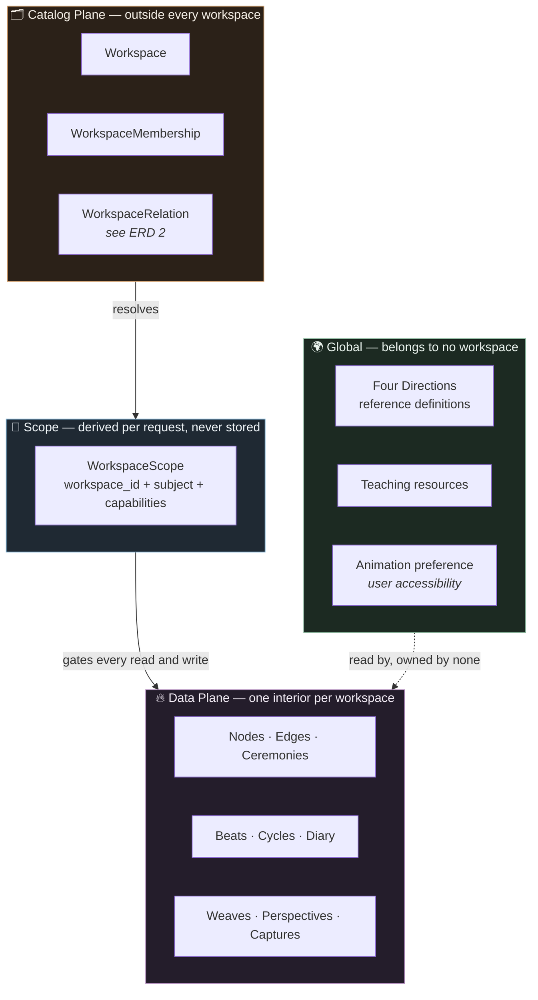

# ERD 1 — A Workspace and Its Interior

> What a wheel workspace *is*, and how it relates to everything the Medicine Wheel already holds.
> This diagram stops at the workspace's own edge. Workspace-to-workspace relations are ERD 2
> (`workspace-erd-relations.md`) — deliberately separated, because mixing the two flattens both.

**Document ID:** rispec-workspace-erd-internal-v1
**Status:** Design — models `workspace-scope-and-access.spec.md`, not current code
**Last Updated:** 2026-09-06

---

## The three planes

Before the entities: a workspace only makes sense if you can see which plane a record sits on.
Almost every mistake available here is a record placed on the wrong plane.

🏕️ *The metaphor:* the **catalog** is the map of the camp — it knows the lodges exist and who may
enter. The **scope** is the key in your hand for one door on one visit. The **data plane** is what is
actually inside a lodge — its fire, its stories, its obligations. The **global** plane is the sky:
East is East from inside every lodge, and no lodge owns it.

---

## ERD 1 — Workspace and its owned records

```mermaid
erDiagram
    SUBJECT ||--o{ WORKSPACE_MEMBERSHIP : "holds"
    WORKSPACE ||--o{ WORKSPACE_MEMBERSHIP : "grants"
    WORKSPACE ||--o{ WORKSPACE_RELATION : "is endpoint of (ERD 2)"

    WORKSPACE ||--o{ RELATIONAL_NODE : "owns"
    WORKSPACE ||--o{ RELATIONAL_EDGE : "owns"
    WORKSPACE ||--o{ CEREMONY_LOG : "owns"
    WORKSPACE ||--o{ NARRATIVE_BEAT : "owns"
    WORKSPACE ||--o{ MEDICINE_WHEEL_CYCLE : "owns"
    WORKSPACE ||--o{ GRAPH_LAYOUT : "owns"
    WORKSPACE ||--o{ UNCLASSIFIED_COLLECTION : "owns (pending classification)"

    RELATIONAL_NODE ||--o{ RELATIONAL_EDGE : "is from_id of"
    RELATIONAL_NODE ||--o{ RELATIONAL_EDGE : "is to_id of"
    RELATIONAL_NODE }o--o| DIRECTION : "faces"
    RELATIONAL_NODE ||--o{ CEREMONY_LOG : "is subject of"
    RELATIONAL_NODE ||--o{ NARRATIVE_BEAT : "is anchored by"
    MEDICINE_WHEEL_CYCLE ||--o{ NARRATIVE_BEAT : "sequences"
    RELATIONAL_NODE ||--o{ GRAPH_LAYOUT_POSITION : "is placed by"
    GRAPH_LAYOUT ||--o{ GRAPH_LAYOUT_POSITION : "contains"

    RELATIONAL_NODE ||--o{ QUALIFIED_REFERENCE : "may point outward via"

    WORKSPACE {
        string id PK "stable, never reused"
        string slug UK "url-safe, unique in deployment"
        string name
        string blurb
        string status "active | archived"
        string direction "optional descriptor: east|south|west|north"
        string color "optional descriptor"
        string repo "optional descriptor — NOT an access grant"
        string created_at
        string updated_at
    }

    SUBJECT {
        string id PK "meaningful only once identity exists"
        string display_name
        string provider "unresolved open decision"
    }

    WORKSPACE_MEMBERSHIP {
        string workspace_id PK, FK
        string subject_id PK, FK
        string role "owner | admin | editor | viewer"
        string state "invited | active | withdrawn"
        string created_at
        string updated_at
    }

    WORKSPACE_RELATION {
        string id PK
        string from_workspace_id FK
        string to_workspace_id FK
        string relationship_type "detailed in ERD 2"
        string state "proposed | active | withdrawn | archived"
    }

    RELATIONAL_NODE {
        string workspace_id PK, FK "mandatory scope"
        string id PK "unique within workspace"
        string name
        string type "land|human|knowledge|ancestor|future|spirit — closed at six"
        string direction FK "nullable"
        string description
        json metadata "carries metadata.kind for additive kinds"
    }

    RELATIONAL_EDGE {
        string workspace_id PK, FK "mandatory scope"
        string from_id PK, FK "same workspace — enforced"
        string to_id PK, FK "same workspace — enforced"
        string relationship_type
        number strength
        boolean ceremony_honored
        json obligations
        string last_ceremony
    }

    CEREMONY_LOG {
        string workspace_id FK
        string id PK
        string ceremony_type
        string phase "opening | council | integration | closure"
        string node_id FK
        string performed_at
    }

    NARRATIVE_BEAT {
        string workspace_id FK
        string id PK
        string cycle_id FK
        number sequence
        string direction FK
        json origin "provenance / telescoping"
    }

    MEDICINE_WHEEL_CYCLE {
        string workspace_id FK
        string id PK
        string name
        string status
    }

    GRAPH_LAYOUT {
        string workspace_id PK, FK "browser key becomes workspace-qualified"
        string id PK "'current' or a saved disposition"
        string name
        string updated_at
        number nodeCount
    }

    GRAPH_LAYOUT_POSITION {
        string layout_id PK, FK
        string node_id PK, FK
        number x
        number y
    }

    QUALIFIED_REFERENCE {
        string uri PK "mw://workspace/:id/node/:id"
        string target_workspace_id "NOT a foreign key — no access implied"
        string target_record_id
        string resolution "resolved | redacted | unavailable | withdrawn"
    }

    UNCLASSIFIED_COLLECTION {
        string family PK "weaves, perspectives, diary, events, captures, charts, mmots"
        string classification "owned | catalog | user-global | deployment-global — OPEN"
    }

    DIRECTION {
        string name PK "east | south | west | north"
        string emoji
        string focus
        string guidance
    }
```

---

## Reading the diagram

**`WORKSPACE` is not a node.** It appears in no `NodeType` union and rides no `metadata.kind`
discriminator. `src/ontology-core/src/types.ts` closes `NodeType` at six and the closure holds. The
workspace is the container the six live inside — one plane up from the ontology, not a member of it.

**`workspace_id` is part of the primary key, not a column beside it.** `RELATIONAL_NODE` is
identified by `(workspace_id, id)`; `RELATIONAL_EDGE` by `(workspace_id, from_id, to_id)`. This is
the difference between isolation and a filter someone can forget to apply. A direct `GET /nodes/:id`
cannot reach across a workspace boundary because the id alone does not name a row.

**Edges cannot leave the workspace.** `from_id` and `to_id` are workspace-aware foreign keys. An
ordinary internal edge spanning two wheels is structurally impossible, not merely discouraged. When
a record genuinely needs to point outward it uses `QUALIFIED_REFERENCE` — which carries identity and
provenance and deliberately is *not* a foreign key, because a foreign key would imply the target
exists and is readable, and neither is guaranteed.

**`DIRECTION` is global and unowned.** The Four Directions are reference data. Every workspace reads
them; none owns them; they are never copied per workspace. Same for teaching resources and the
animation accessibility preference.

**`UNCLASSIFIED_COLLECTION` is drawn on purpose.** Inquiry weaves, plan perspectives, diary entries,
ceremony events, captures, structural tension charts, and MMOTs have no classification yet. Leaving
them off the diagram would let them stay accidentally global, which is exactly the failure
`workspace-scope-and-access.spec.md` names: *a collection cannot remain accidentally global.*

**`SUBJECT` is drawn dotted in intent.** It has no implementation and no chosen provider. Everything
downstream of it — memberships, capabilities, private multi-user claims — is blocked on that open
decision.

---

## Cardinality notes worth arguing about later

| Relationship | Chosen | Why, and what would change it |
| --- | --- | --- |
| `WORKSPACE ‖--o{ RELATIONAL_NODE` | one-to-many, mandatory | A node with no workspace is unreachable. Migration gives orphans to the legacy/default workspace. |
| `RELATIONAL_NODE }o--o‖ DIRECTION` | many-to-zero-or-one | A node may be released from its direction (`direction: null` in `NodePatch`). |
| `GRAPH_LAYOUT` scoped | yes | Positions are meaningless against another workspace's node set. |
| Animation preference scoped | **no** | It is an accessibility preference of a person, not a property of a place. |
| Node id uniqueness | per workspace | Global uniqueness is Open Decision #5; per-workspace is assumed here and marked. |

---

## Related

- `workspace-erd-relations.md` — ERD 2: the relations between workspaces
- `workspace-configuration.spec.md` — what building this implies
- `workspace-scope-and-access.spec.md` — the architecture being modelled
- `../ontology-core.spec.md` — the closed six-type union

🌸: A workspace is not a filter over one shared world. It is a world with a door.
