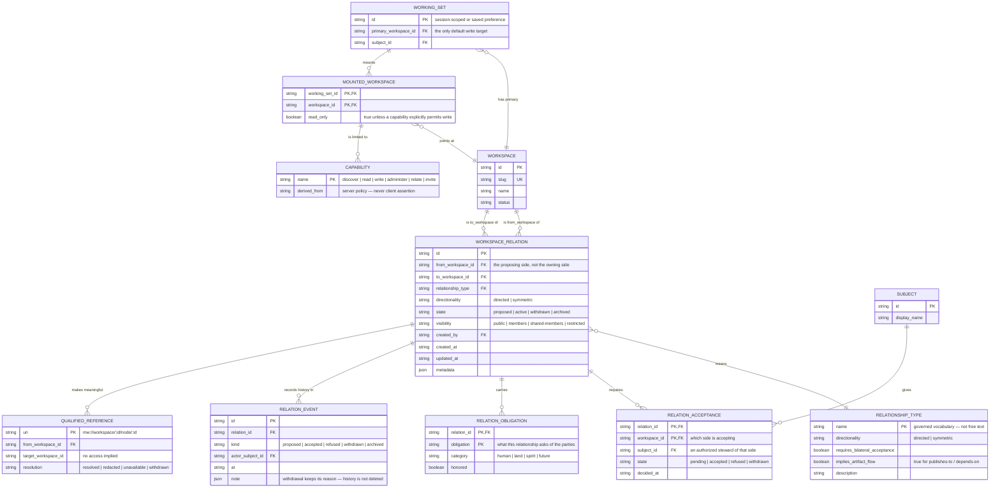
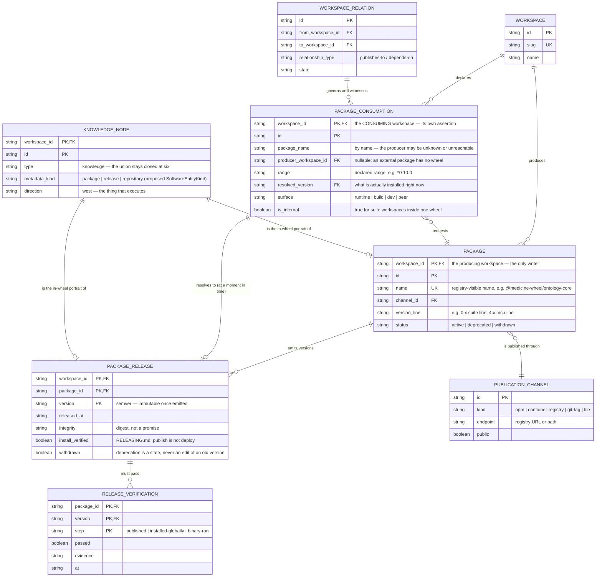
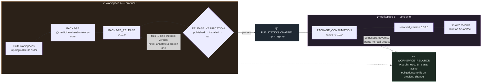

# ERD 2 — Workspace to Workspace, and the Package Economy

> The second diagram exists because the first could not hold this without lying. A workspace's
> interior (ERD 1) is a containment story: one owner, many owned records. A relation *between*
> workspaces is a governance story: two owners, one record, neither holding the whole truth — plus,
> in software, a versioned flow of artifacts that has its own life.

**Document ID:** rispec-workspace-erd-relations-v1
**Status:** Design — extends `workspace-scope-and-access.spec.md`; the software entity kinds are a proposal
**Last Updated:** 2026-09-06

---

> [!CAUTION]
> **Diverged from the requirement — see `STATUS.md` (2026-09-06).** The requirement is **one server
> that resolves the store per request**. This document was written assuming one server per location.
> It is kept as evidence, not reverted. Read `STATUS.md` §6 for what in it survives.
>
> **Still not settled — `STATUS.md` §0.** The requirement was stated a third time after this banner
> was written: **one storage location, many workspaces inside it.** That is not the several-locations
> model this folder was corrected to, and the two are still both present. The requester's words:
> *"we did not understood each other on the definition of the workspace."*

## Why this is a separate diagram

Three things about workspace↔workspace relations refuse to sit inside ERD 1:

1. **The relation is its own record with its own owner problem.** `WorkspaceRelation` is not a
   foreign key on either workspace. Neither endpoint may unilaterally assert it, and withdrawal is
   a state change, not a delete.
2. **Visibility ≠ access.** Seeing that A relates to B tells you nothing about whether you may read
   B. The diagram has to show a relationship that deliberately does **not** propagate reachability.
3. **The artifact flow is a different graph.** "A produces packages that B consumes" is not one
   edge. It is a package, a stream of versioned releases, a declared range on the consumer's side,
   and a resolution between them that changes over time without anyone editing the relationship.

🌾 *The metaphor:* the **relation** is the agreement between two camps that one will send corn each
harvest. The **package economy** is the actual corn — which year's harvest, how much, whether it
arrived. Recording only the agreement tells you nothing about whether anyone ate. Recording only the
corn tells you nothing about whether it was owed, gifted, or taken.

---

## ERD 2a — The governed relationship

### Proposed governed vocabulary

Free-text `relationship_type` is how a vocabulary dies. A starting governed set, each row a decision
someone must actually make:

| `name` | Directionality | Bilateral acceptance | Implies artifact flow | Meaning |
| --- | --- | --- | --- | --- |
| `publishes-to` | directed | yes | **yes** | The producer releases artifacts the consumer takes up |
| `depends-on` | directed | yes | **yes** | The inverse view, asserted by the consumer |
| `derived-from` | directed | no | no | This workspace began as a fork, extraction, or descendant |
| `mirrors` | symmetric | yes | no | Two workspaces intentionally hold the same material |
| `collaborates-with` | symmetric | yes | no | Shared active work without shared records |
| `shares-context-with` | symmetric | yes | no | Mutual discoverability for agents composing a working set |

Reuse existing kinship vocabulary from `ontology-core` **where its meaning truly applies** — not
mechanically. A workspace relation is between *places*; kinship edges are between *beings*. Where
the words coincide, check the meaning before borrowing it.

### Two invariants the diagram is drawn to enforce

- **`WORKSPACE_RELATION` has no owner side.** `from_workspace_id` records who *proposed*, and
  `RELATION_ACCEPTANCE` carries one row per endpoint. `state` becomes `active` only when both
  required acceptances are `accepted`. Withdrawal writes a `RELATION_EVENT` and moves state; nothing
  is deleted.
- **Nothing in this diagram grants read access.** `MOUNTED_WORKSPACE` is the *only* path to another
  workspace's records, it is explicit, it defaults to read-only, and its capabilities are derived
  server-side. A `WORKSPACE_RELATION` next to it is context, not a key. Membership in A never
  implies membership in B.

---

## ERD 2b — The package economy

This is the requester's example made explicit: *the result of one workspace creates packages
consumed within another workspace.*

The producing side and the consuming side are **not** two halves of one edge. They are two
assertions that may disagree, and a resolution that changes without either of them being edited.

### The flow, end to end

---

## What ERD 2b is deliberately saying

**The same shape appears at two scales, and only one of them exists today.**
Inside the `medicine-wheel` wheel workspace, 27 suite workspaces already produce packages consumed
by each other — that is the topological `workspaces` array in root `package.json`, and it is an
*intra*-workspace dependency graph. Across wheel workspaces (medicine-wheel → iaip), the identical
shape becomes *inter*-workspace. `PACKAGE_CONSUMPTION.is_internal` is the flag that distinguishes
them, and it is the whole reason the two must not be modelled as one relation type.

**Producer and consumer assert separately, on purpose.** `PACKAGE` is written only by the producing
workspace. `PACKAGE_CONSUMPTION` is written only by the consuming workspace. Neither can edit the
other's row. A consumer may declare a dependency on a package whose producing workspace it cannot
read, or that has no wheel at all (`producer_workspace_id` nullable — most of npm). This is not a
modelling compromise; it is the honest shape of the world.

**The resolution moves without an edit.** `range` is a declaration; `resolved_version` is a fact
about right now. A lockfile change moves the fact without touching the declaration or the
relationship. Modelling this as a single `depends-on` edge would make every install a relationship
change, which is both false and unusably noisy.

**`RELEASE_VERIFICATION` is in the diagram because `RELEASING.md` says it must be.** Publishing is
not deploying, and a green publish is not a working install. The three steps — published, installed
globally, binary ran — are separate rows because two of them have historically passed while the
third failed, and the whole procedure exists to catch that gap. A `PACKAGE_RELEASE` with
`install_verified: false` is a release nobody should consume.

**Cycles are legal at the relation level and illegal at the release level.** A and B may each
`publishes-to` the other — that is reciprocity, and reciprocity is not a bug. But
`PACKAGE_CONSUMPTION → PACKAGE_RELEASE` must be acyclic *for any single resolution moment*, because
a build has to terminate. Two different diagrams, two different rules; drawing them as one graph
would force a false constraint onto one of them.

**Software entities ride existing nodes.** `KNOWLEDGE_NODE.metadata_kind` proposes a
`SoftwareEntityKind` of `package | release | repository`, following the pattern already established
by `ProductionEntityKind`, `InfraEntityKind`, and `AcademicEntityKind` in
`src/ontology-core/src/types.ts`. Direction binding follows the infra precedent: a package is
**west** — the thing that executes. The `NodeType` union stays closed at six. The knowledge node is
the *portrait* of the package in the wheel; `PACKAGE` is the registry record. They are joined
optionally, and the wheel can hold either without the other.

---

## Open decisions specific to ERD 2

1. Does `publishes-to` require bilateral acceptance, or may a producer declare it unilaterally
   (given that consumers frequently do not know they are known)?
2. Is a `PACKAGE_CONSUMPTION` on an unreachable producer workspace visible in that producer's own
   view? Disclosing it leaks that B exists; hiding it leaves A blind to its own reach.
3. Where does `RELEASE_VERIFICATION` evidence live — as records, or as CI attestations referenced by
   qualified identity?
4. Should `SoftwareEntityKind` be added to `ontology-core` at all, or should packages stay purely
   catalog-plane records with no in-wheel portrait?
5. What obligation vocabulary is governed for `publishes-to` — "notify on breaking change" is a
   real reciprocal duty, and unenforced obligations that are never named are how reciprocity
   quietly becomes extraction.

---

## Related

- `workspace-erd-internal.md` — ERD 1: what a workspace holds
- `workspace-configuration.spec.md` — the implications of building it
- `workspace-scope-and-access.spec.md` — relational access semantics in full
- `../ontology-core.spec.md` — the additive-kind pattern this proposal follows
- `../../RELEASING.md` — why `RELEASE_VERIFICATION` has three steps

🌸: A dependency is a relationship someone is having whether or not it was agreed to. The catalog is where it can become an agreement.
