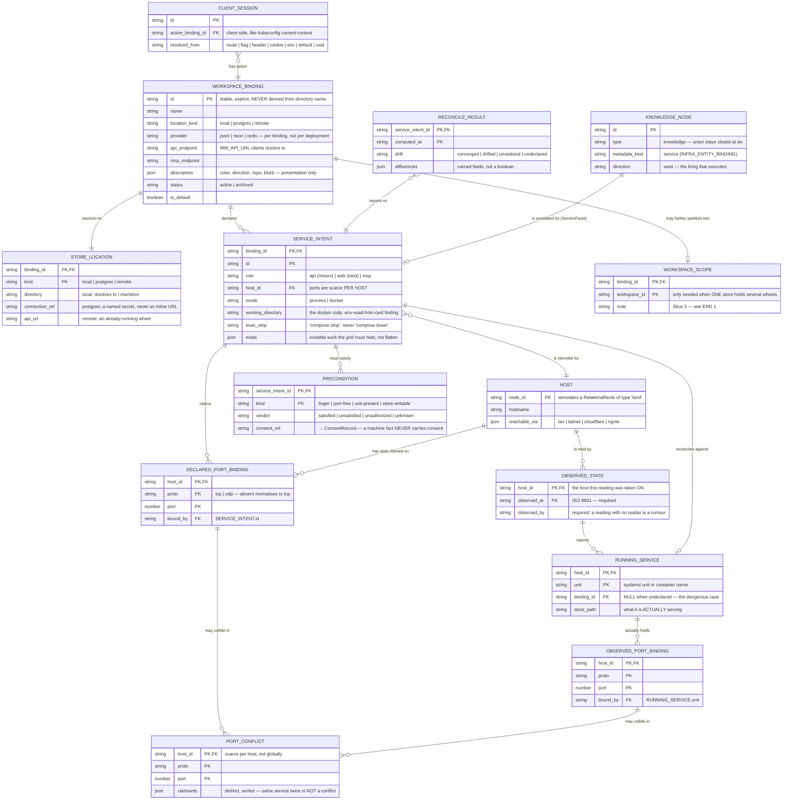
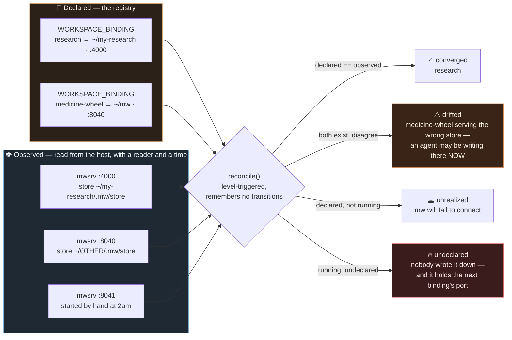

# ERD 3 — The Service Configuration Layer

> The diagram the first two were missing. ERD 1 modelled what a workspace *holds*; ERD 2 modelled how
> workspaces *relate*. Neither modelled the thing that actually runs: a binding resolved into
> services, ports claimed on a host, and declared state reconciled against what is really running.

**Document ID:** rispec-workspace-erd-services-v1
**Status:** Design — extends `workspace-definition.spec.md`; builds on shipped `@medicine-wheel/infra`
**Last Updated:** 2026-09-06

---

> [!NOTE]
> **Corrected 2026-09-06 — see `STATUS.md`.** The requirement is **one server that resolves the store
> per request**: choosing a workspace changes what the running server reads and writes on disk. This
> document has been corrected to that; where older sections still describe one server per location,
> they say so.

## Scope of this diagram — corrected 2026-09-06

This models **several servers on one or more hosts**: ports, preconditions, and declared-versus-
observed drift. That is real and it is `@medicine-wheel/infra`'s territory.

It is **not** the requirement. The requirement is *one* server resolving a store per request — see
`STATUS.md` and `workspace-definition.spec.md` §2.0. Where this diagram implies that switching
workspace means starting or restarting a service, that implication is superseded: switching is a
resolver lookup inside a running process. `SERVICE_INTENT` here declares a server; it does not
declare a workspace.

---

## What this layer answers

Four questions the system cannot answer today:

1. Which wheels exist on this machine, by name?
2. Which are running, and on what ports?
3. Is what is running the same as what was declared?
4. **Is something running that nobody wrote down** — holding the port the next wheel wants?

⚙️ *The metaphor:* the binding is the **written arrangement** — who camps where, which fire is whose.
The running services are the **fires actually burning**. `reconcile()` is walking the camp at dusk
and comparing. `undeclared` is the fire nobody claims, in the spot the next family was promised.

---

## ERD 3 — bindings, services, ports, drift

---

## The reconciliation loop

---

## What ERD 3 is deliberately saying

**`WORKSPACE_BINDING` and `WORKSPACE_SCOPE` are different tables, on purpose.** kubeconfig keeps
*context* (client-side, groups access parameters under a convenient name) separate from *namespace*
(server-side resource). Collapsing them is what let a colour-switcher be mistaken for isolation.
`WORKSPACE_SCOPE` is drawn as `||--o|` — **optional** — because it is only needed when one store
holds several wheels. Bind separate locations and you may never need it.

**Declared and observed are separate tables that never merge.** Not two views of one truth. The
whole value is in their disagreement. `OBSERVED_STATE` requires `observed_by` and `observed_at`
because `src/infra/src/reconcile.ts` says it: *an observation with no reader and no time is a rumour,
and reconciling against a rumour is how the snapshot problem comes back wearing a different hat.*

**`RUNNING_SERVICE.binding_id` is nullable, and that null is the point.** It is the `undeclared`
state — the `mwsrv` someone started by hand, which is exactly the service holding the port the next
binding is about to be given. A model without that null cannot report the failure that actually
happens.

**`host_id` is part of every port key.** Ports are scarce *per host*. `:4444` on `eury` and `:4444` on
`gaia` are not in tension; the shipped `detectPortConflicts` already encodes this, along with the
rule that the same service claiming a slot twice (once declared, once observed) is not a conflict.

**`PRECONDITION.verdict` has four values, not two.** `unauthorized` is its own verdict: the machine
is ready and the human has not said yes. `preconditions.ts` guards this explicitly — once granted
consent is inferred from a machine fact, withdrawing consent stops meaning anything, because the flag
is still set. A store directory being writable is never permission to write in it.

**`metis` survives into the service layer.** `MetisHold` exists so the ontology can *hold* the
"restart it twice, the first start races the mount" that keeps a system alive. A workspace registry
that normalises that away would be a legibility grid doing the harm it was built to avoid.

**`SERVICE_INTENT` annotates a node; it is not a node.** Per `INFRA_ENTITY_BINDING`, a service rides
a `knowledge` node facing **west** — the thing that executes. `FACET_NODE_TYPES` is typed against the
closed union on purpose, so the union cannot widen without a compile error. Nothing here adds a
seventh `NodeType`.

**`CLIENT_SESSION.resolved_from` is recorded, not just resolved.** When something goes wrong the
first question is *why does this client think it is in that workspace* — and the answer must not
require guessing which of seven sources won.

---

## Related

- `workspace-definition.spec.md` — the definition this diagram serves
- `workspace-prior-art.research.md` — kubectl contexts, Compose project names, level-triggered reconciliation
- `workspace-erd-internal.md` — ERD 1, the scope layer (Slice 3)
- `workspace-erd-relations.md` — ERD 2, the governance layer (Slice 4)
- `src/infra/` — `ServiceFacet`, `PortBinding`, `detectPortConflicts`, `reconcile`, `Precondition`, `MetisHold`

> [!NOTE]
> **The root `CLAUDE.md` understates what `infra` ships.** It reads *"`@medicine-wheel/infra` is
> types plus one pure function (`detectPortConflicts`)"*. `src/infra/src/index.ts` says otherwise
> and the files are there: `ports.ts` (S3), `preconditions.ts` (S4), `reconcile.ts` (S6),
> `schemas.ts`, alongside `MetisHold` (S5) in `types.ts`. Everything this diagram builds on exists
> and is exported. A reader who checks `CLAUDE.md` first will conclude ERD 3 rests on code that was
> never written; correcting that line is `CLAUDE.md`'s owner's call, not this folder's.
- `../infrastructure-topology-ui.spec.md` — the operator-facing surface this could render into

🌸: Configuration that cannot be compared against what is running is not configuration. It is a wish with a filename.
